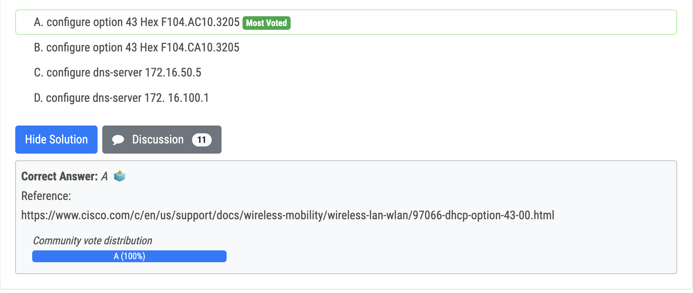
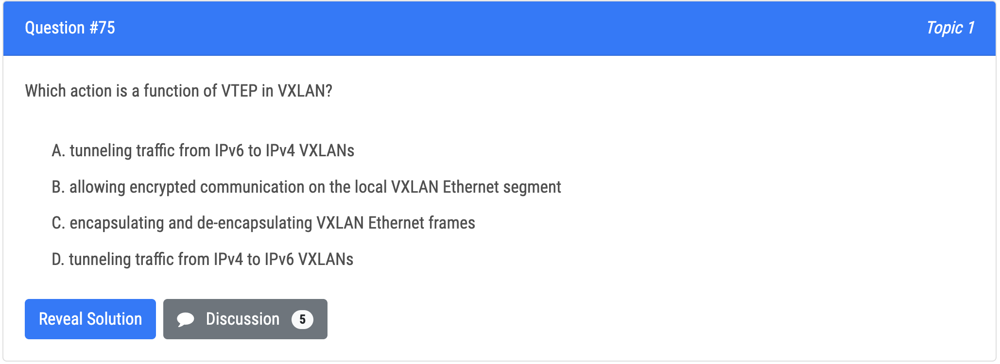

vManager - is the controller and cisco considers it the management plane 

vSmart - is the control plane. 

vEdge is the data plane. 

vBond is the orchestrator plane, and according to cisco it authenticates the vSmart controllers and the SD-WAN routers and orchestrates connectivity between them. 

It is the only device that must have a public IP address so that all SD-WAN devices in the network can connect to it. A vBond orchestrator is an SD-WAN router that only performs vBond orchestrator functions.

SD-Access Fabric Roles and Terminology Control Plane Node, Border Node, Edge Node, and other Fabric elements.

"Punt" is often used to describe the action of moving a packet from the fast path (CEF) to the route processor for handling. Cisco Express Forwarding (CEF) provides the ability to switch packets through a device in a very quick and efficient way while also keeping the load on the router‘s processor low. 

CEF is made up of two different main components: the Forwarding Information Base (FIB) and the Adjacency Table. Process switching is the slowest switching methods (compared to fast switching and Cisco Express Forwarding) because it must find a destination in the routing table. 

Process switching must also construct a new Layer 2 frame header for every packet. With process switching, when a packet comes in, the scheduler calls a process that examines the routing table, determines which interface the packet should be switched to and then switches the packet. The problem is, this happens for the every packet.

- onboard vEdge nodes into the SD-WAN fabric (vBond) 

- gather telemetry data from vEdge routers (vAnalytics) 

- distribute security information for tunnel establishment between vEdge routers (vSmart) - 
- manage, maintain, and gather configuration and status for nodes within the SD-WAN fabric (vManage)

Q89

Q168

Q139

Q119

