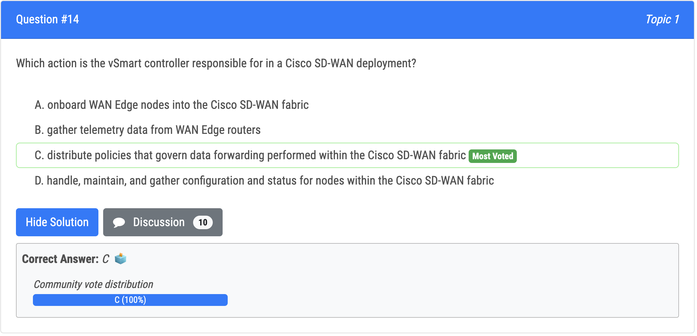
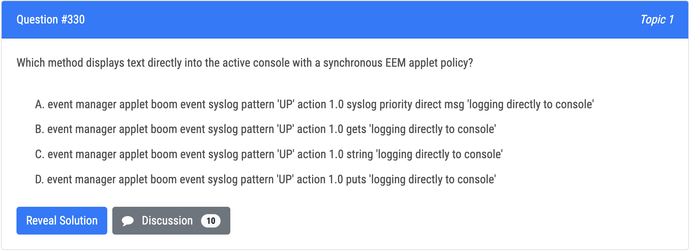
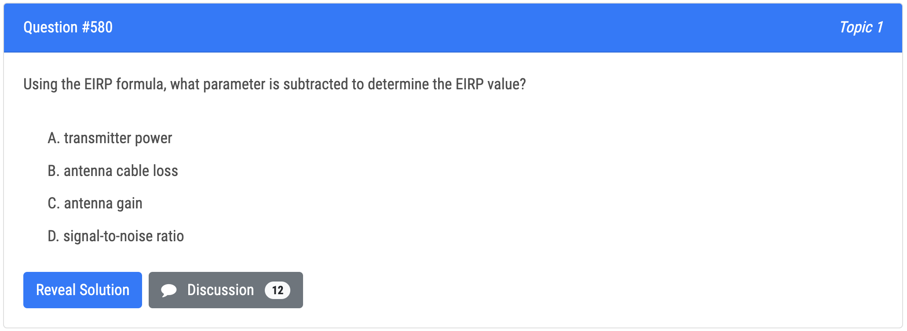

vManager - is the controller and cisco considers it the management plane 

vSmart - is the control plane. 

vEdge is the data plane. 

vBond is the orchestrator plane, and according to cisco it authenticates the vSmart controllers and the SD-WAN routers and orchestrates connectivity between them. 

It is the only device that must have a public IP address so that all SD-WAN devices in the network can connect to it. A vBond orchestrator is an SD-WAN router that only performs vBond orchestrator functions.


SD-Access Fabric Roles and Terminology Control Plane Node, Border Node, Edge Node, and other Fabric elements.




"Punt" is often used to describe the action of moving a packet from the fast path (CEF) to the route processor for handling. Cisco Express Forwarding (CEF) provides the ability to switch packets through a device in a very quick and efficient way while also keeping the load on the router‘s processor low. 

CEF is made up of two different main components: the Forwarding Information Base (FIB) and the Adjacency Table. Process switching is the slowest switching methods (compared to fast switching and Cisco Express Forwarding) because it must find a destination in the routing table. 

Process switching must also construct a new Layer 2 frame header for every packet. With process switching, when a packet comes in, the scheduler calls a process that examines the routing table, determines which interface the packet should be switched to and then switches the packet. The problem is, this happens for the every packet.


- onboard vEdge nodes into the SD-WAN fabric (vBond) 

- gather telemetry data from vEdge routers (vAnalytics) 

- distribute security information for tunnel establishment between vEdge routers (vSmart) - 
- manage, maintain, and gather configuration and status for nodes within the SD-WAN fabric (vManage)


Q89


Q168


Q139


Q119


Q259


Q253


Q381

Q380

Q360





  


Q463

Q461


Q435


Q428


Q582




Q575


Q558

Q556


Q553


Q531


Q520


Q518


Q677


Q611

Q609


Q603


Q714

Q715


Q719

Q722


Q727


Q743


Q767


## LAB 744 / 745 / 746 / 747 / 751 / 752 / 754 /

 

Q751

```shell
event manager applet int_loopback_Shutdown
event syslog pattern "Interface Loopback0, changed state to administratively down"
action 1.0 cli command "enable"
action 1.5 cli command "config ter"
action 2.0 cli command "interface loopback0"
action 2.5 cli command "no shutdown"
action 3.0 cli command "end"
```

Q752


1. Configure a SPAN session on SW01 using these parameters:

• Session Number: 20
• Source Interface: VLAN 99
• Traffic Direction: Transmitted Traffic
• Destination Interface: Ethernet 0/1

2. Configure the NetFlow Top Talkers feature for outbound traffic on interface E0/2 of R01 with these parameters:

• Number of Top Talkers: 50
• Sort Type: Packets
• Cache Timeout: 30 seconds

3. Configure an IP SLA operation on SW02 and start the ICMP probe with these parameters:

• Entry Number: 10
• Target IP: 1.1.1.1
• Source IP: 172.16.2.2
• Frequency: 5 seconds
• Threshold: 250 milliseconds
• Timeout: 3000 milliseconds
• Lifetime: Forever

```shell
### Task1 ### 
SW1:
config ter
monitor session 20
source vlan 99 tx
destination interface ethernet 0/1

### Task2 ###
R01:
config ter
interface eth0/2
ip flow egress
ip flow-top-talkers
top 50
sort-by packets
cache-timeout 30000

### Task3 ###
SW02:
ip sla 10
icmp-echo 1.1.1.1 source-ip 172.16.2.2
frequency 5
threshold 250
timeout 3000

ip sla schedule 10 life forever start-time now
```


Q754 GLBP

```shell
Primary Switch:

interface vlan 100
ip address 192.168.1.2 255.255.255.0
glbp 30 ip 192.168.1.254
glbp 30 priority 130
glbp 30 preempt delay minimum 35
end

Secondary Switch:

interface vlan 100 
ip address 192.168.1.3 255.255.255.0
glbp 30 ip 192.168.1.254
```

