# **Packet Forwarding**

## 1. **Network Device Communication**

### VLAN

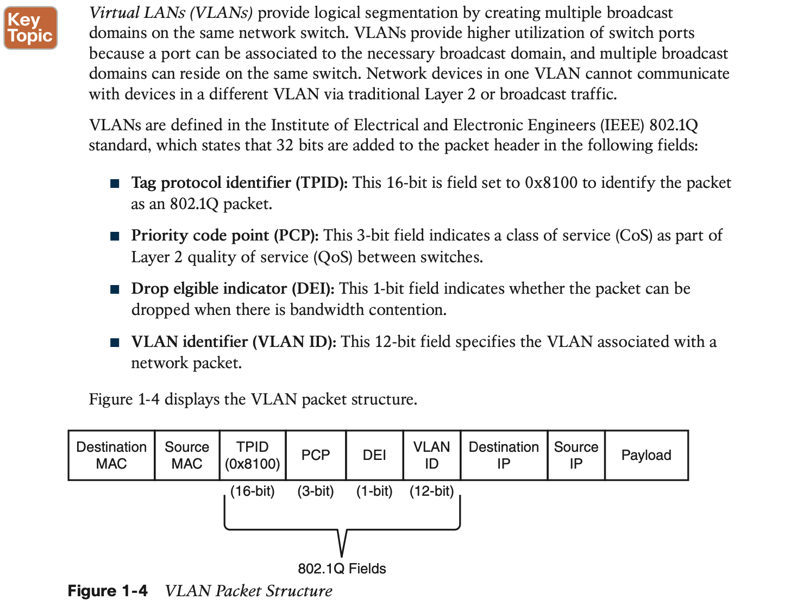

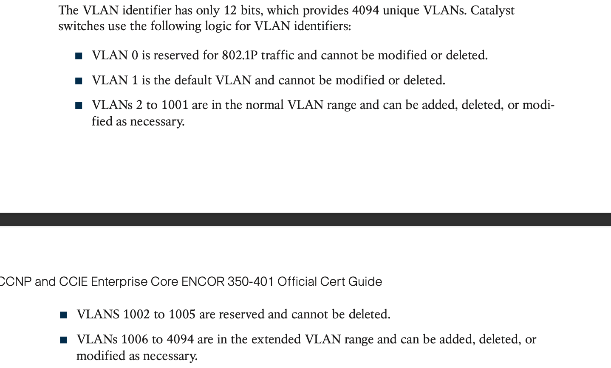

### Access Ports

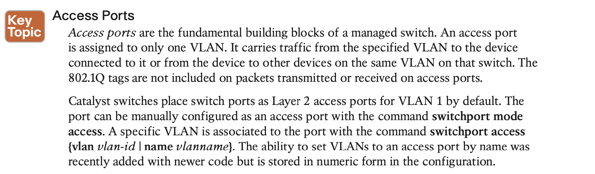

### Trunk Ports

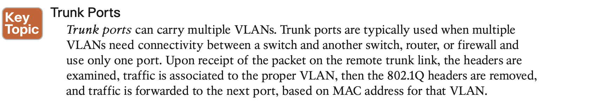

### MAC address

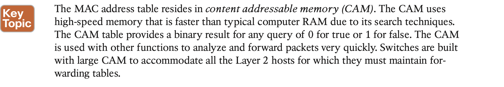

### ARP

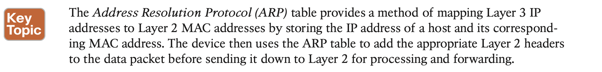

### Packet Routing 

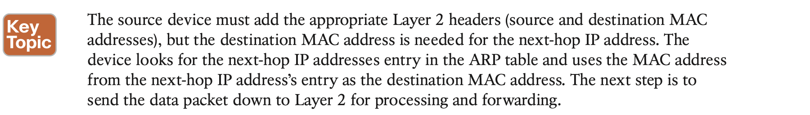

### IP Address Assignment

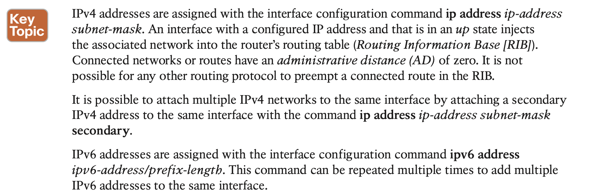

## 2. **Forwarding Architectures**

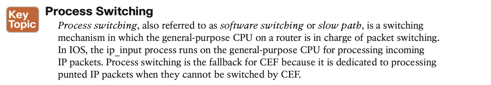

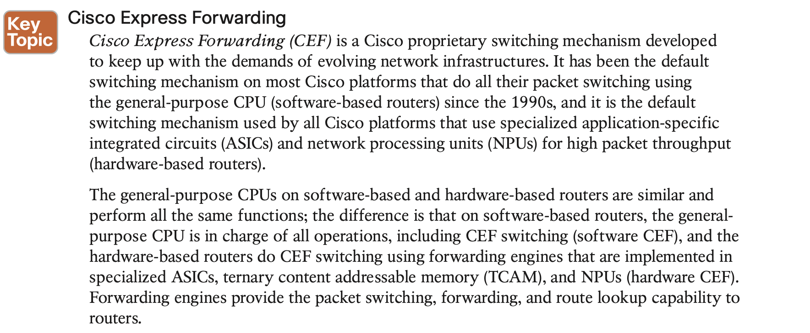

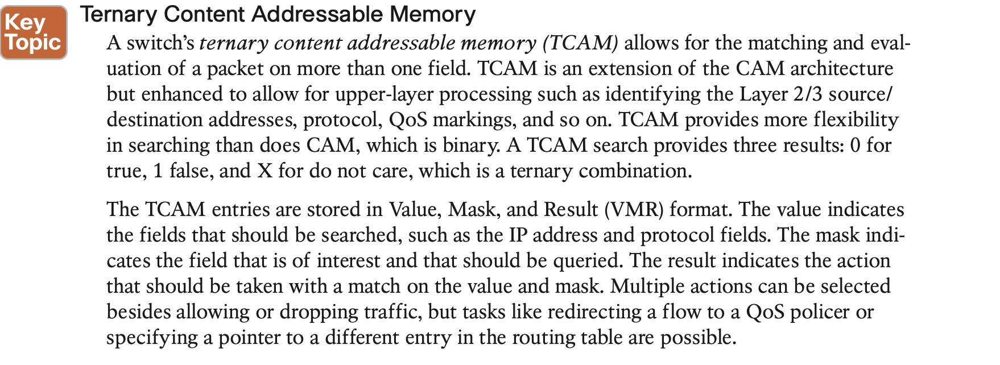

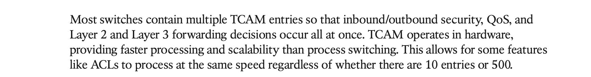

#### Centralized Vs. Distributed Forwarding Architectures

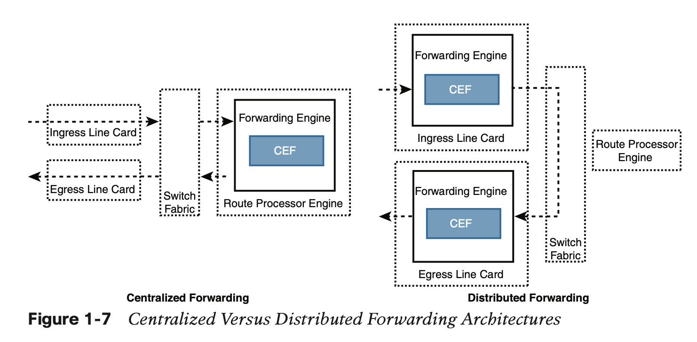

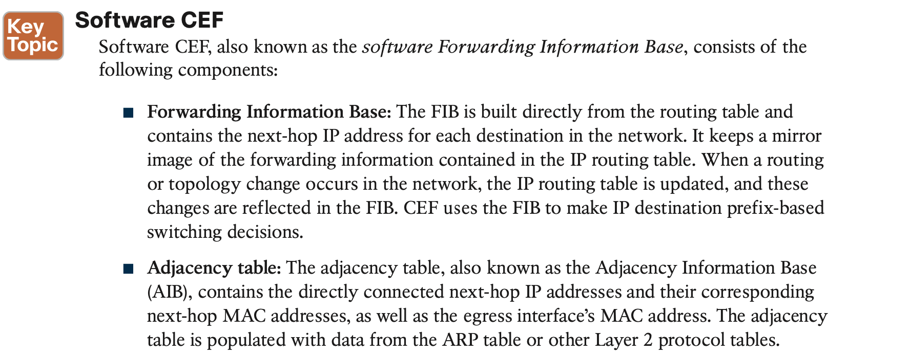

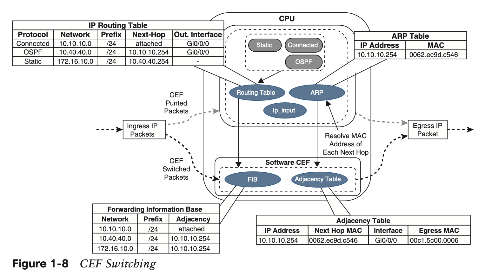

Upon receipt of an IP packet, the FIB is checked for a valid entry. If an entry is missing, it is a “glean” adjacency in CEF, which means the packet should go to the CPU because CEF is unable to handle it. Valid FIB entries continue processing by checking the adjacency table for each packet’s destination IP address. Missing adjacency entries invoke the ARP process. Once ARP is resolved, the complete CEF entry can be created.

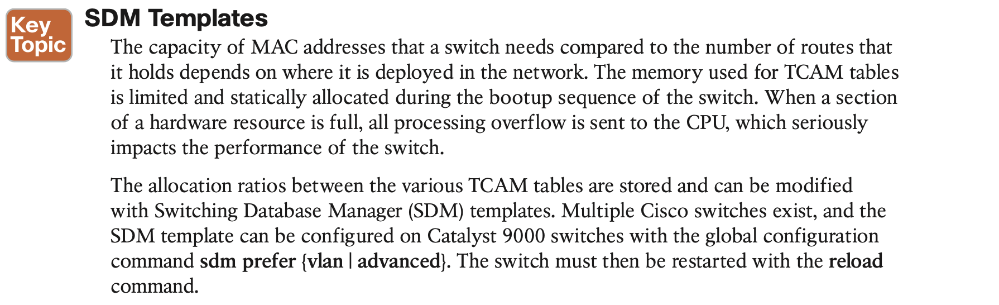
