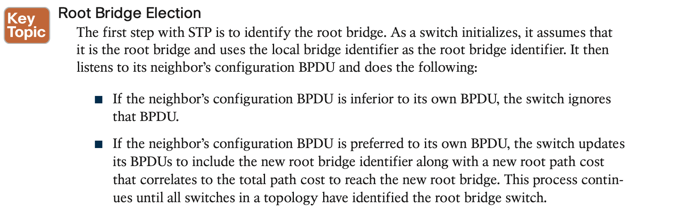

# **Spanning Tree Protocol**

## 1. **Spanning Tree Protocol Fundamentals**

bridge protocol data units (BPDUs)

STP has multiple iterations:

- 802.1D, which is the original specification

- Per-VLAN Spanning Tree (PVST)

- Per-VLAN Spanning Tree Plus (PVST+)

- 802.1W Rapid Spanning Tree Protocol (RSTP)

- 802.1S Multiple Spanning Tree Protocol (MST)

  Catalyst switches now operate in PVST+, RSTP, and MST modes. All three of these modes are backward compatible with 802.1D.

## 2. **Rapid Spanning Tree Protocol**

