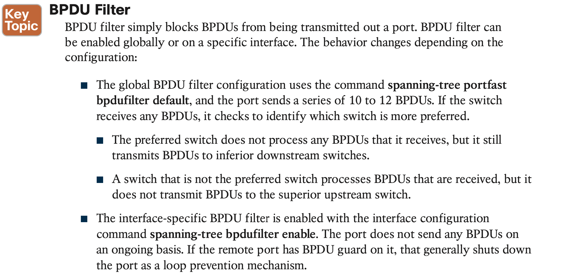

# **Advanced STP Tuning**

## 1. **STP Topology Tuning**

## 2. **Additional STP Protection Mechanisms**

#### 2.1 **Root Guard**

#### 2.2 **STP Portfast**

#### 2.3 **BPDU Guard**

#### 2.4 **BPDU Filter**

#### 2.5 **Problems with Unidirectional Links**

1. **STP Loop Guard**

STP loop guard prevents any alternative or root ports from becoming designated ports (ports toward downstream switches) due to loss of BPDUs on the root port. Loop guard places the original port in an ErrDisabled state while BPDUs are not being received. When BPDU transmission starts again on that interface, the port recovers and begins to transition through the STP states again.

Loop guard is enabled globally by using the command **spanning-tree loopguard default**, or it can be enabled on an interface basis with the interface command **spanning-tree guard loop**. **It is important to note that loop guard should not be enabled on portfast-enabled ports** (because it directly conflicts with the root/alternate port logic).

2. **Unidirectional Link Detection**

Unidirectional Link Detection (UDLD) allows for the bidirectional monitoring of fiber-optic cables. UDLD operates by transmitting UDLD packets to a neighbor device that includes the system ID and port ID of the interface transmitting the UDLD packet. The receiving device then repeats that information, including its system ID and port ID, back to the originating device. 

