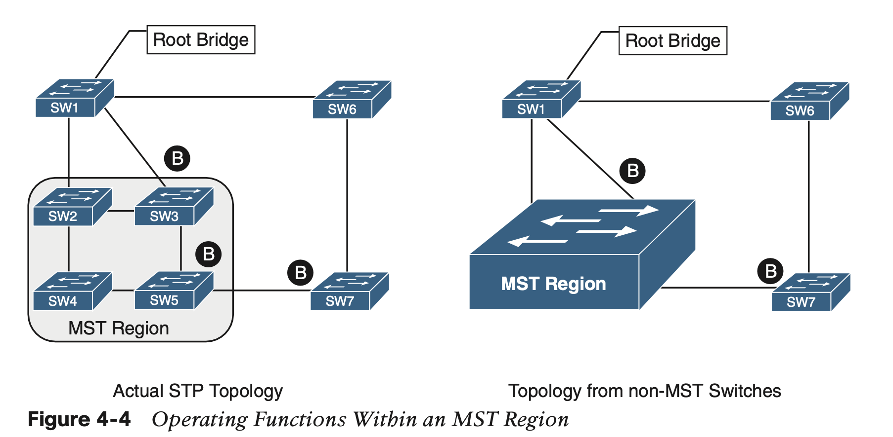
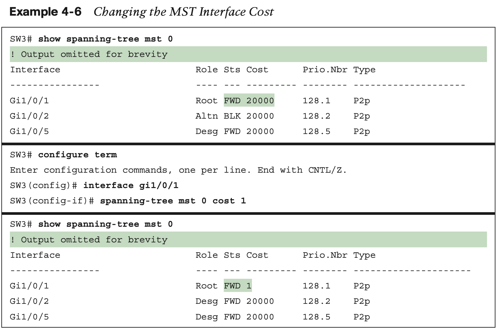

# **Multiple Spanning Tree Protocol**

Cisco developed the **Per-VLAN Spanning Tree (PVST) protocol** to allow for an STP topology for each VLAN. With PVST, the root bridge can be placed on a different switch or can cost ports differently, on a VLAN-by-VLAN basis. This allows for a link to be blocked for one VLAN and forwarding for another.

### **MST Instances (MSTIs)**

### **MST Configuration**

### **MST Verification**

The relevant spanning tree information can be obtained with the command **show spanning- tree**. However, the VLAN numbers are not shown, and the MST instance is provided instead. In addition, the priority value for a switch is the MST instance plus the switch priority. Example 4-3 shows the output of this command.

A consolidated view of the MST topology table is displayed with the command **show spanning-tree mst** [instance-number].

The specific MST settings are viewed for a specific interface with the command **show spanning-tree mst interface** interface-id, as shown in Example 4-5. 

### **MST Tuning**

### **Common MST Misconfigurations**

There are two common misconfigurations within the MST region that network engineers should be aware of:

- VLAN assignment to the IST
- Trunk link pruning

### **MST Region Boundary**

## **Command Reference**

