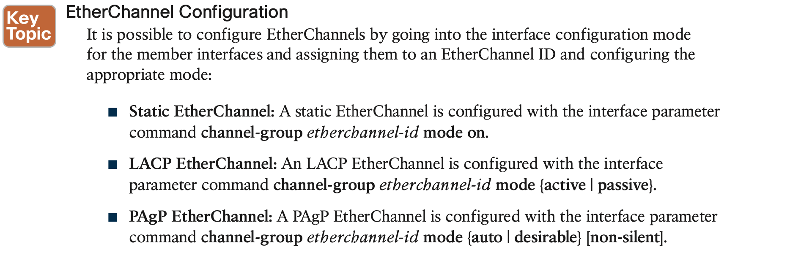

# **VLAN Trunks and EtherChannel Bundles**

## 1. **VLAN Trunking Protocol**

Adding a VLAN might seem like a simple task, but in an environment with 100 switches, adding a VLAN required logging in to 100 switches to provision one VLAN. Thanks to VTP, switches that participate in the same VTP domain can have a VLAN created once on a VTP server and propagated to other VTP client switches in the same VTP domain.

Figure 5-1 shows a simple topology in which SW1 is the VTP server, and SW2, SW4, SW5, and SW6 are VTP clients. SW3 is in transparent mode and does not update its VLAN database as changes are propagated through the VTP domain. SW3 forwards VTP changes to SW6.

VTP supports having multiple VTP servers in a domain. These servers process updates from other VTP servers just as a client does. If a VTP domain is Version 3, the primary VTP server must be set with the executive command **vtp primary**.

### **VTP Communication**

### **VTP Configuration**

 

### **VTP Verification**

## 2. **Dynamic Trunking Protocol**

A trunk link can successfully form in almost any combination of these modes **unless both ends are configured as dynamic auto.** Table 5-2 shows a matrix for successfully establishing a dynamic trunk link.

## 3. **EtherChannel Bundle**

Ideally, it would be nice to plug in a second cable and double the bandwidth between the switches. However, Spanning Tree Protocol (STP) will place one of the ports into a blocking state to prevent forwarding loops, as shown in Figure 5-2.

Fortunately, the physical links can be aggregated into a logical link called an EtherChannel bundle. The industry-based term for an EtherChannel bundle is EtherChannel (for short), or port channel, which is defined in the IEEE 802.3AD link aggregation specification. The physical interfaces that are used to assemble the logical EtherChannel are called member interfaces. STP operates on a logical link and not on a physical link. The logical link would then have the bandwidth of any active member interfaces, and it would be load balanced across all the links. EtherChannels can be used for either Layer 2 (access or trunk) or Layer 3 (routed) forwarding.

### **Dynamic Link Aggregation Protocols**

Two common link aggregation protocols are Link Aggregation Control Protocol (LACP) and Port Aggregation Protocol (PAgP). PAgP is Cisco proprietary and was developed first, and then LACP was created as an open industry standard. All the member links must participate in the same protocol on the local and remote switches.

#### **Verifying Port-Channel Status**

#### **Viewing EtherChannel Neighbors**

#### **Verifying EtherChannel Packets**

#### **Advanced LACP Configuration Options**

**LACP Fast**

…

#### **Troubleshooting EtherChannel Bundles**

It is important to remember that a port channel is a logical interface, so all the member interfaces must have the same characteristics. If they do not, problems will occur.

#### **Load Balancing Traffic with EtherChannel Bundles**

