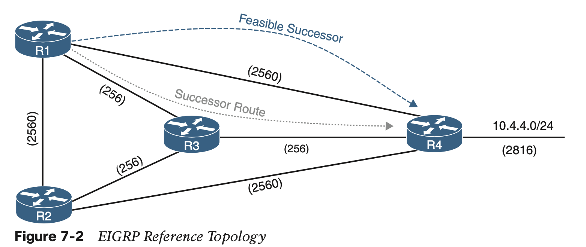
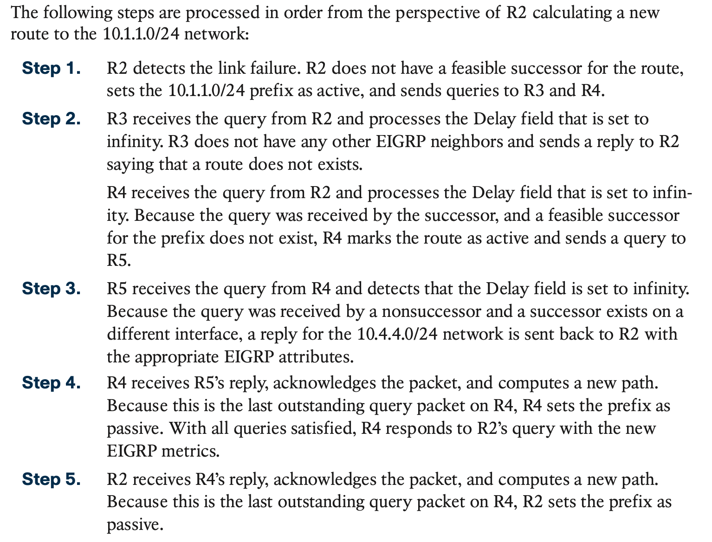

# **EIGRP**

## 1. **EIGRP Fundamentals**

#### **Autonomous Systems**

#### **EIGRP Terminology**

This section explains some of the core concepts of EIGRP and the path selection process in EIGRP. Figure 7-2 is the reference topology for this section;

#### **Topology Table**

#### **EIGRP Neighbors**

## 2. **Path Metric Calculation**

**Wide Metrics**

#### **Metric Backward Compatibility**

#### **Load Balancing**

## 3. **Failure Detection and Timers**

## 4. **Route Summarization**

