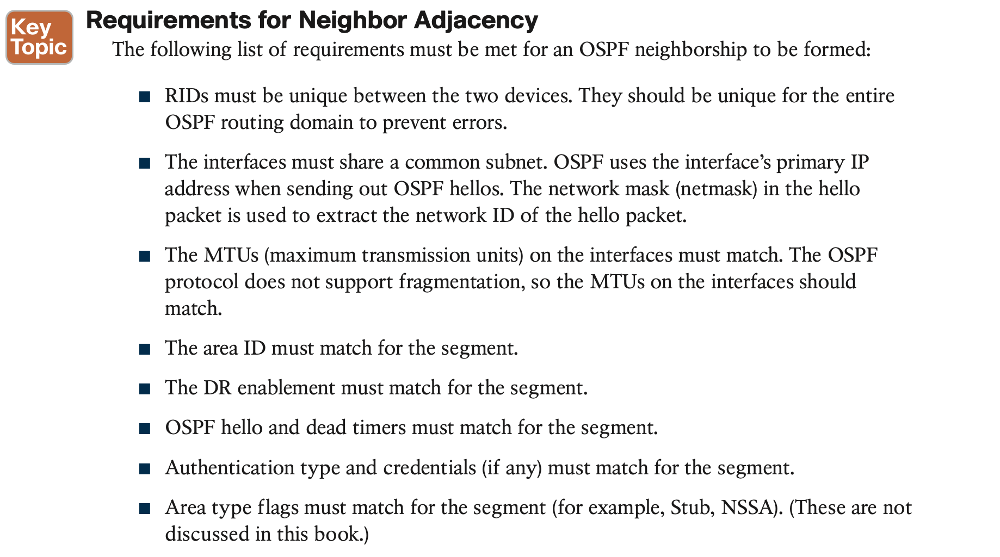
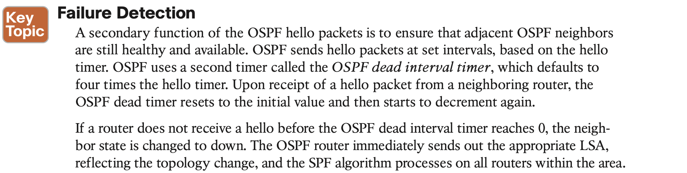

# OSPF

## 1. **OSPF Fundamentals**

## 2. **OSPF Configuration**

#### **Confirmation of Interfaces**

It is a good practice to verify that the correct interfaces are running OSPF after making changes to the OSPF configuration. The command **show ip ospf interface** [**brief** | interface-id] displays the OSPF-enabled interfaces.

#### **Verification of OSPF Neighbor Adjacencies**

#### **Verification of OSPF Routes**

## 3. **Default Route Advertisement**

## 4. **Common OSPF Optimizations**

The following sections explain the DR election process and how the DR role can be assigned to specific hardware.

**Setting an interface priority to 0 removes that inter- face from the DR/BDR election immediately. Raising the priority above the default value (1) makes that interface more favorable compared to interfaces with the default value.**

#### **OSPF Network Types**

**Broadcast**

The OSPF network type is set to broadcast by default for Ethernet interfaces. A DR is required for this OSPF network type because of the possibility that multiple nodes can exist on a segment, and LSA flooding needs to be controlled. The hello timer defaults to 10 seconds, as defined in RFC 2328.

The interface parameter command **ip ospf network broadcast** overrides the automatically configured setting and statically sets an interface as an OSPF broadcast network type.

**Point-to-Point Networks**

A network circuit that allows only two devices to communicate is considered a point-to- point (P2P) network. Because of the nature of the medium, point-to-point networks do not use Address Resolution Protocol (ARP), and broadcast traffic does not become the limiting factor.

The OSPF network type is set to point-to-point by default for serial interfaces (HDLC or PPP encapsulation), generic routing encapsulation (GRE) tunnels, and point-to-point Frame Relay subinterfaces. Only two nodes can exist on this type of network medium, so OSPF does not waste CPU cycles on DR functionality. The hello timer is set to 10 seconds on OSPF point-to-point network types.

**Loopback Networks**

The OSPF network type loopback is enabled by default for loopback interfaces and can be used only on loopback interfaces. 

The OSPF loopback network type states that the IP address is always advertised with a /32 prefix length, even if the IP address configured on the loopback interface does not have a /32 prefix length. It is possible to demonstrate this behavior by reusing Figure 8-11 and advertising a Loopback 0 interface.

