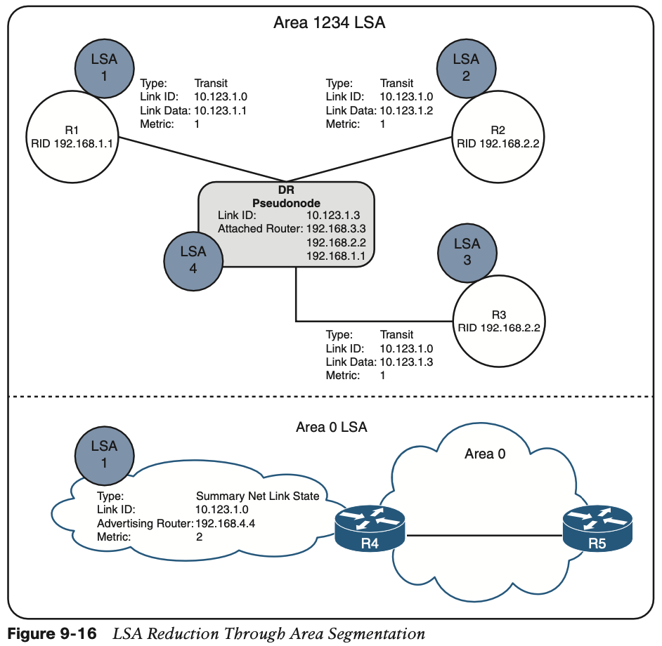

# **Advanced OSPF**

## 1.**Areas**

#### **OSPF Route Types**

## 2. **Link-State Announcements**

#### **LSA Types**

1. **LSA Type 1: Router Link**

2. **LSA Type 2: Network Link**

3. **LSA Type 3: Summary Link**

## 3. **Discontiguous Networks**

**NOTE** Real-life scenarios of discontiguous networks involve Area 0 becoming partitioned due to hardware failures. Ensuring that multiple paths exist to keep the backbone contiguous is an important factor in network design.

## 4. **OSPF Path Selection**

#### **Intra-Area Routes**

#### **Interarea Routes**

## 5. **Summarization of Routes**

## 6. **Route Filtering**

#### **Filtering with Summarization**

One of the easiest methodologies for filtering routes is to use the **not-advertise** keyword during prefix summarization. Using this keyword prevents creation of any type 3 LSAs for any networks in that range, thus making the subordinate routes visible only within the area where the route originates.

The full command structure is **area** area-id **range** network subnet-mask **not-advertise** under the OSPF process.

#### **Area Filtering**

#### **Local OSPF Filtering**

