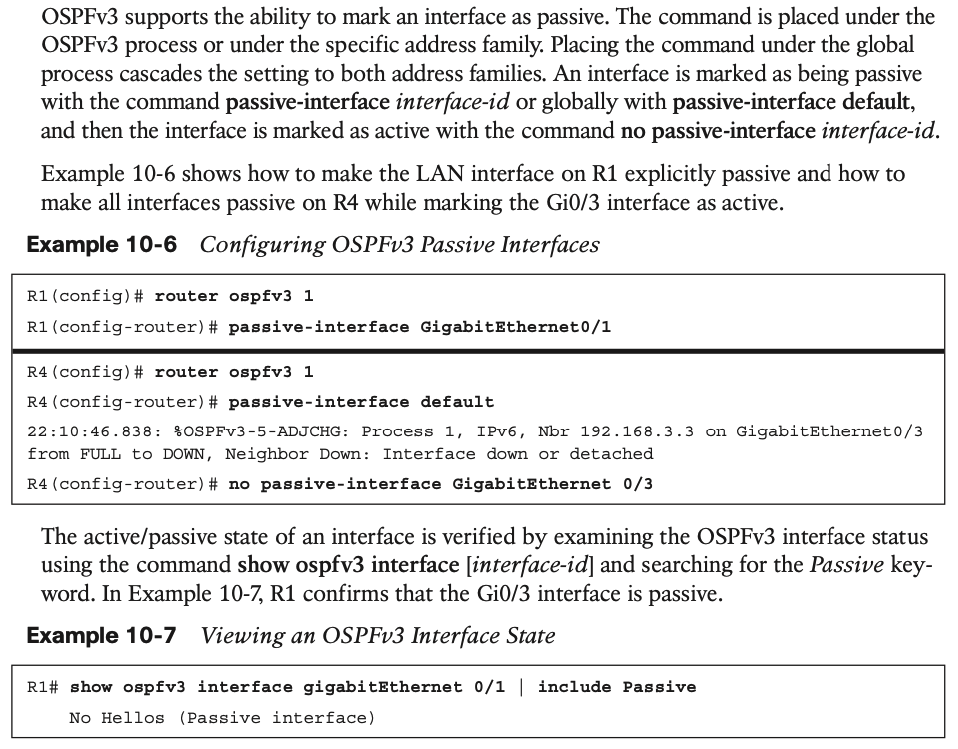

# **OSPFv3**

## 1. **OSPFv3 Fundamentals**

#### **OSPFv3 Link-State Advertisement**

OSPFv3 packets use protocol ID 89, and routers communicate with each other using the local interface’s IPv6 link-local address. 

IP address information is advertised independently by two new LSA types:

- Intra-area prefix LSA
- Link-local LSA

Table 10-2 provides a brief description of each OSPFv3 LSA type.

#### **OSPFv3 Communication**

OSPFv3 uses the same five packet types and logic as OSPFv2. Table 10-3 shows the name, address, and purpose of each of the five packets types.

## 2. **OSPFv3 Configuration**

## 3. **OSPFv3 Verification**

#### **Passive Interface**

#### **Summarization**

#### **Network Type**

OSPFv3 supports the same OSPF network types as OSPFv2. Example 10-11 shows that R2’s Gi0/3 interface is set as a broadcast OSPF network type and is confirmed as being in a DR state.

## 4.IPv4 Support in OSPFv3

Using the topology shown in Figure 10-1, IPv4 addressing has been placed onto R1, R2, R3, and R4 using the conventions outlined earlier. Example 10-14 demonstrates the deployment of IPv4 using the existing OSPFv3 deployment.

