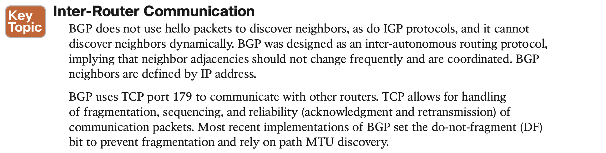

# BGP

## 1. **BGP Fundamentals**

## 2. **Basic BGP Configuration**

Example 11-12 shows the installation of R3’s and R4’s loopback using a **network** statement. Specifying every network prefix that should be advertised might seem tedious. R5’s loop- back was learned by redistributing OSPF straight into BGP.

#### **Route Summarization**

## 3. **Multiprotocol BGP for IPv6**

