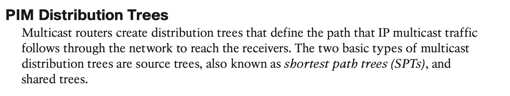
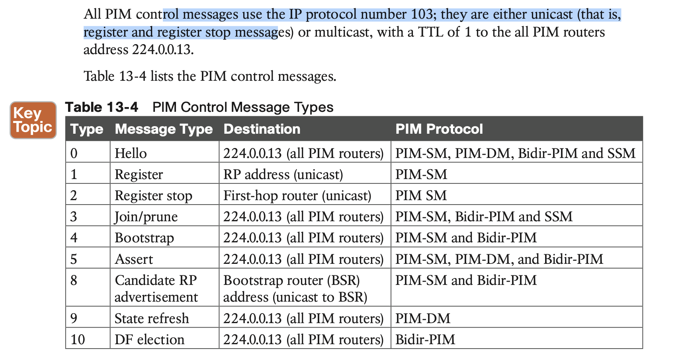

# **Multicast**

## 1. **Multicast Fundamentals**

Multicast communication is a technology that optimizes network bandwidth utilization and conserves system resources. It relies on **Internet Group Management Protocol (IGMP)** for its operation in Layer 2 networks and **Protocol Independent Multicast (PIM)** for its operation in Layer 3 networks.

## 2. **Multicast Addressing**

## 3. **Internet Group Management Protocol**

#### **IGMP Snooping**

## 4. **Protocol Independent Multicast**

#### **PIM Dense Mode**

Figure 13-15 shows the flood and prune operation of Dense Mode. The multicast traffic from the source is flooding throughout the entire network. As each router receives the multicast traffic from its upstream neighbor via its RPF interface, it forwards the multicast traffic to all its PIM-DM neighbors. This results in some traffic arriving via a non-RPF interface, as in the case of R3 receiving traffic from R2 on its non-RPF interface. Packets arriving via the non-RPF interface are discarded.

#### **PIM Sparse Mode**

**PIM Shared and Source Path Trees**

## 5. **Rendezvous Points**

