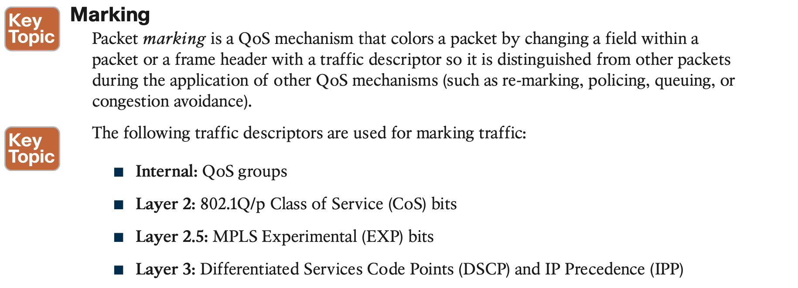
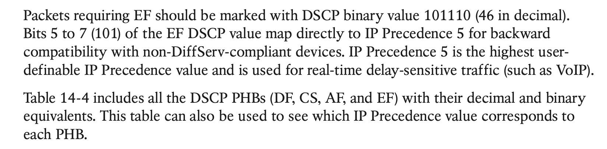
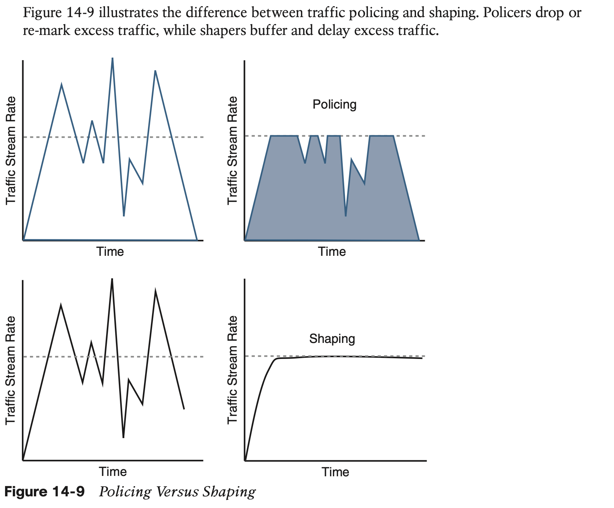
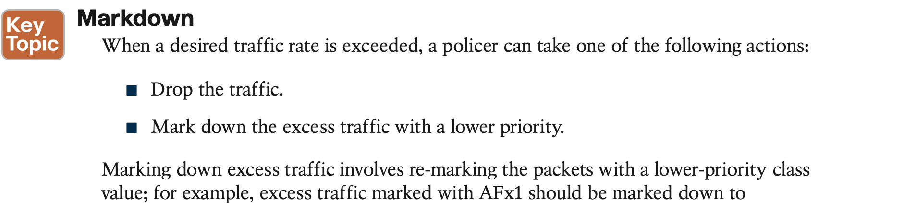

# QoS

## 1.The Need for QoS

The following are the leading causes of quality issues:

- Lack of bandwidth
- Latency and jitter
- Packet loss

Network latency can be broken down into fixed and variable latency:

- Propagation delay (fixed)
- Serialization delay (fixed)
- Processing delay (fixed)
- Delay variation (variable)

## 2. QoS Models

## 3. Classification and Marking

This section introduces the concepts of classification and marking, explains the different marking options that are available for Layer 2 frames and Layer 3 packets, and explains where classification and marking tools should be used in a network.

#### Layer 2 Marking

**One drawback of using CoS markings is that frames lose their CoS markings when traversing a non-802.1Q link or a Layer 3 network.** For this reason, packets should be marked with other higher-layer markings whenever possible so the marking values can be preserved end-to-end. This is typically accomplished by mapping a CoS marking into another marking. For example, the CoS priority levels correspond directly to IPv4’s IP Precedence Type of Service (ToS) values so they can be mapped directly to each other.

#### Layer 3 Marking

#### **A Practical Example: Wireless QoS**

## 4. Policing and Shaping

#### Single-Rate Two-Color Markers/Policers

#### Single-Rate Three-Color Markers/Policers (srTCM)

#### Two-Rate Three-Color Markers/Policers (trTCM)

## 5. Congestion Management and Avoidance

This section explores the queuing algorithms used for congestion management as well as packet drop techniques that can be used for congestion avoidance. These tools provide a way of managing excessive traffic during periods of congestion.

The current queuing algorithms recommended for rich-media networks (and supported by MQC) combine the best features of the legacy algorithms. These algorithms provide real-time, delay-sensitive traffic bandwidth and delay guarantees while not starving other types of traffic. The recommended queuing algorithms include the following:

#### **Congestion-Avoidance Tools**

