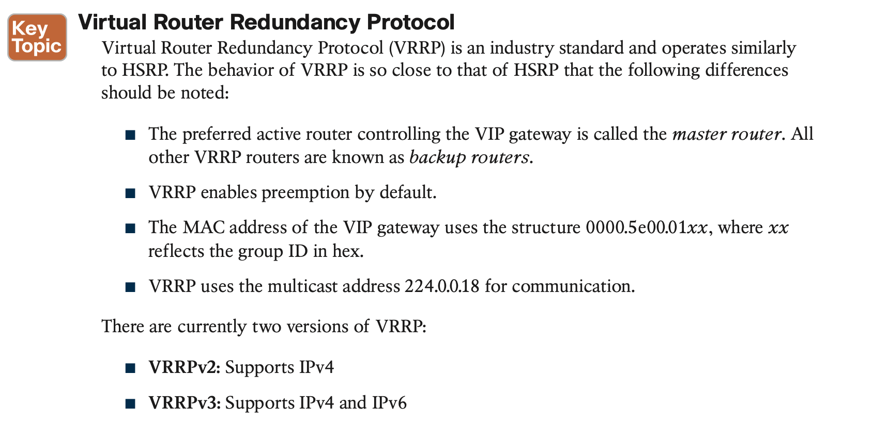
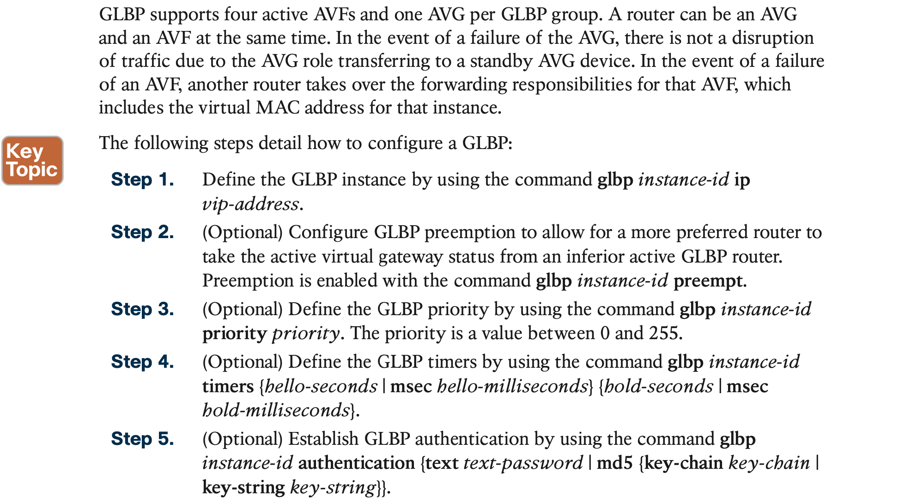
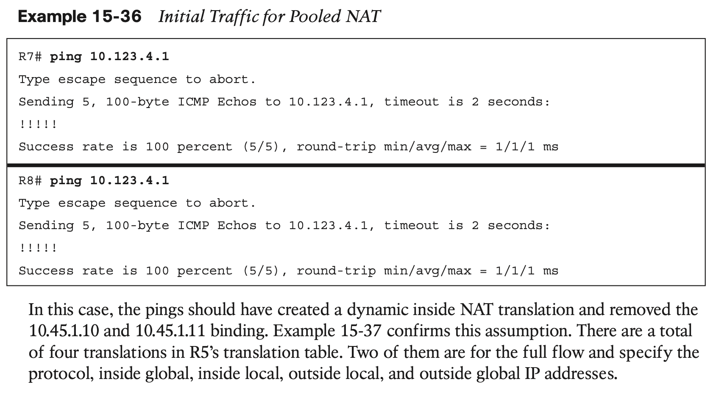

# **IP Services**

## 1. **Time Synchronization**

### **NTP Configuration**

In the topology shown in Figure 15-2, R4 will always use R1 for synchronizing its time because it is a stratum 1 server. If R2 crashes, as shown at the bottom of Figure 15-2, preventing R4 from reaching R1, it synchronizes with R3’s time (which may or may not be different due to time drift) and turns into a stratum 4 time device. When R2 recovers, R4 synchronizes with R1 and becomes a stratum 2 device again.

## 2. **First-Hop Redundancy Protocol**

#### **Object Tracking**

Object tracking offers a flexible and customizable mechanism for linking with FHRPs and other routing components (for example, conditional installation of a static route). With this feature, users can track specific objects in the network and take necessary action when any object’s state change affects network traffic.

### 2.1 **Hot Standby Router Protocol**

**NOTE** HSRP does not support preemption by default, so when a router with lower priority becomes active, it does not automatically transfer its active status to a superior router.

### 2.2 **Virtual Router Redundancy Protocol**

### 2.3 **Global Load Balancing Protocol**

## 3. **Network Address Translation (NAT)**

### 3.1 **Static NAT**

