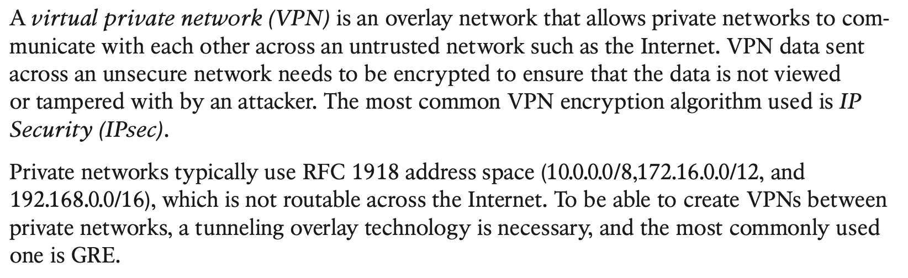
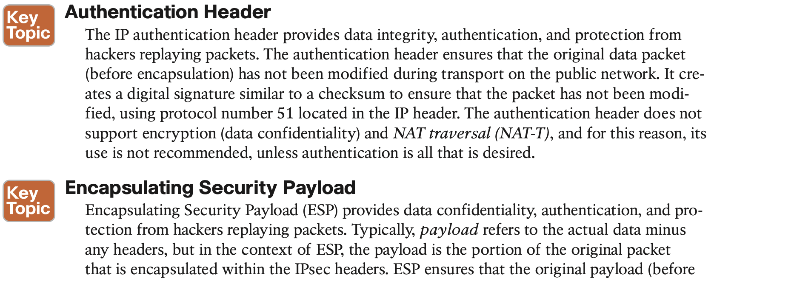
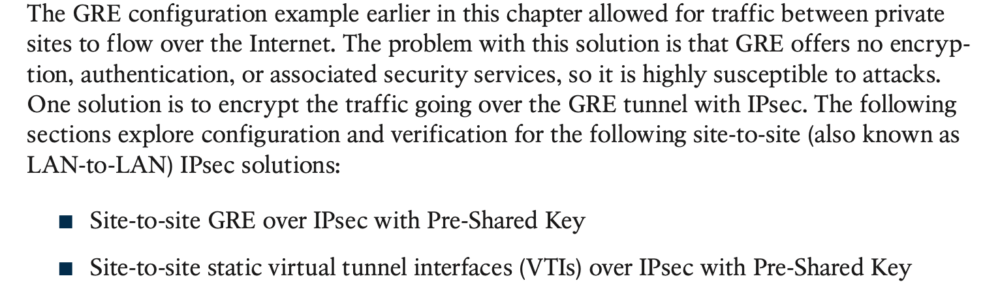
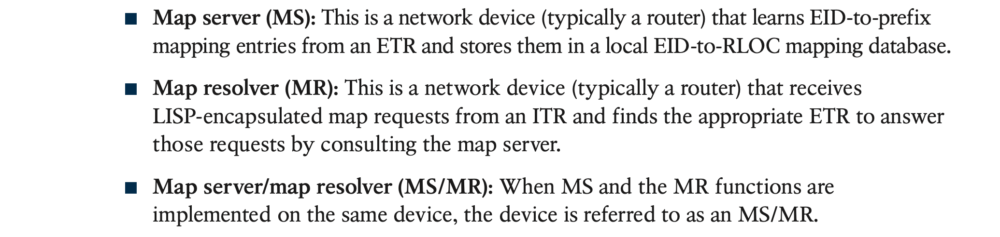
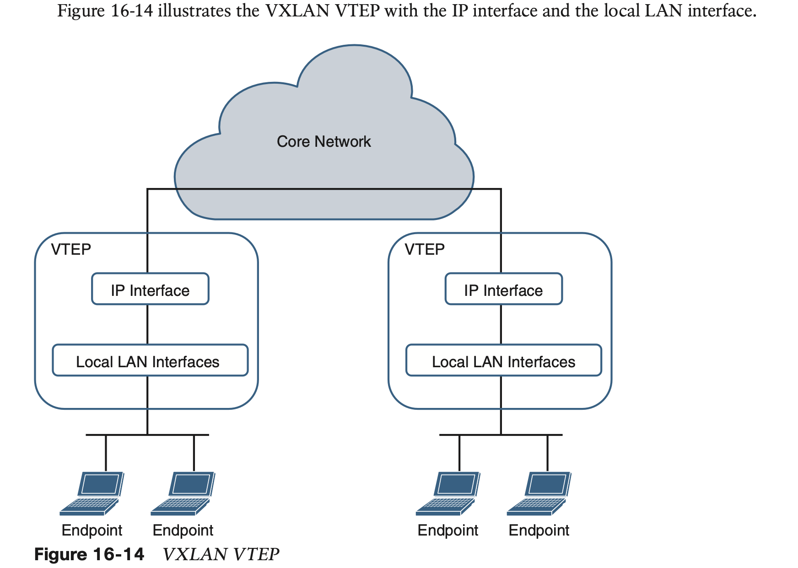

# **Overlay Tunnels**

Examples of overlay tunneling technologies include the following:

- Generic Routing Encapsulation (GRE)
- IP Security (IPsec)
- Locator ID/Separation Protocol (LISP)
- Virtual Extensible LAN (VXLAN)
- Multiprotocol Label Switching (MPLS)

## 1. **Generic Routing Encapsulation (GRE) Tunnels**

### **GRE Tunnel Configuration**

#### **GRE Configuration Example**

#### **Problems with Overlay Networks: Recursive Routing**

## 2. **IPsec Fundamentals**

### **IPsec VPNs**

### **Site-to-Site IPsec Configuration**

#### Site-to-Site GRE over IPsec

## 3. **Cisco Location/ID Separation Protocol (LISP)**

#### **LISP Architecture and Protocols**

#### **LISP Operation**

## 4. **Virtual Extensible Local Area Network (VXLAN)**

Devices that are not capable of supporting VXLAN and need to use traditional VLAN seg- mentation can be connected to VXLAN segments by using a VXLAN gateway. A VXLAN gateway is a VTEP device that combines a VXLAN segment and a classic VLAN segment into one common Layer 2 domain.

As illustrated in Figure 16-15, LISP encapsulation is only capable of performing IP-in-IP/ UDP encapsulation, which allows it to support Layer 3 overlays only, while VXLAN encap- sulation is capable of encapsulating the original Ethernet header to perform MAC-in-IP encapsulation, which allows it to support Layer 2 and Layer 3 overlays.
