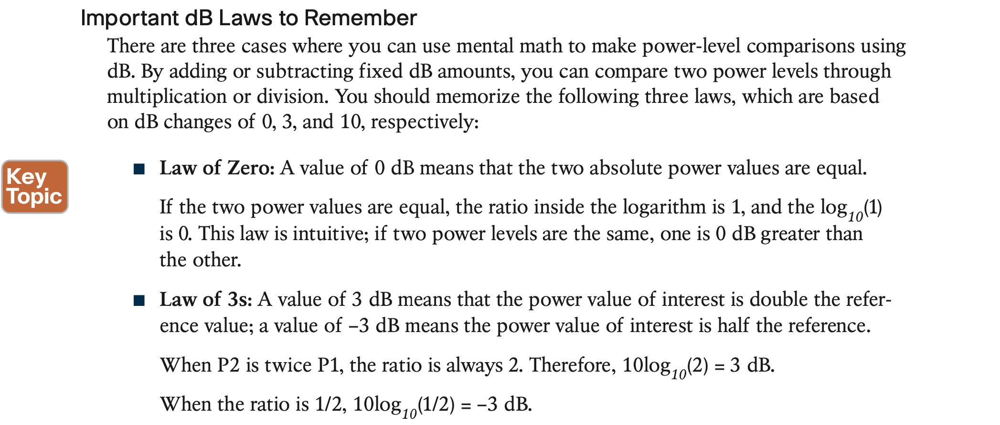

# **Wireless Signals and Modulation**

## 1. **Understanding Basic Wireless Theory**

#### Comparing Power Against a Reference: dBm

#### Measuring Power Changes Along the Signal Path

Once you know the complete combination of transmitter power level, the length of cable, and the antenna gain, you can figure out the actual power level that will be radiated from the antenna. This is known as the **effective isotropic radiated power (EIRP)**, measured in dBm.

#### Free Space Path Loss

## 2. **Carrying Data Over an RF Signal**

#### **Using Multiple Radios to Scale Performance**

As the conditions deteriorate, less-complex schemes can be selected, resulting in a greater range but lower data rates. The scheme selection is commonly known as dynamic rate shifting (DRS). As its name implies, it can be performed dynamically with no manual intervention.

