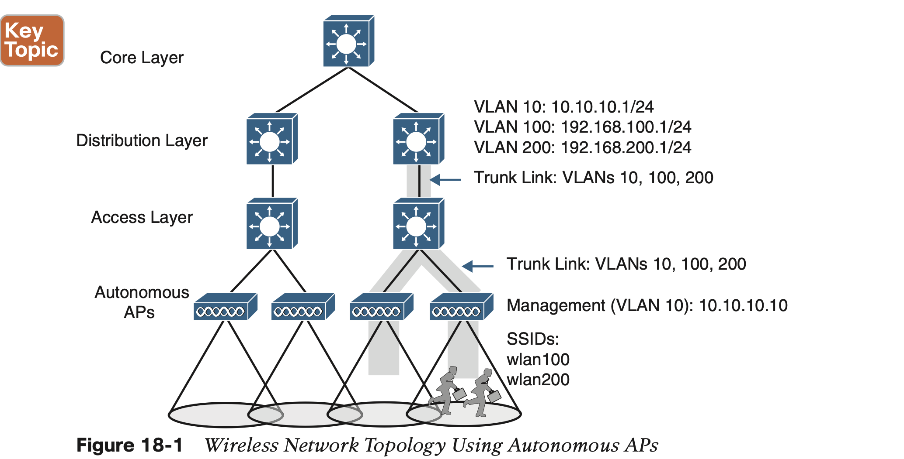
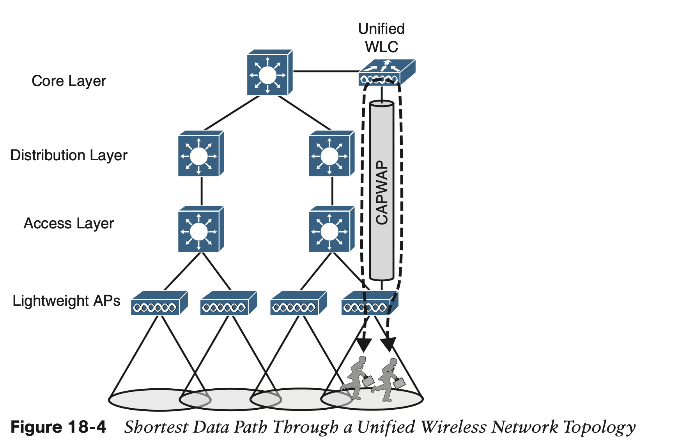

# **Wireless Infrastructure**

## 1. **Wireless LAN Topologies**

#### **Autonomous Topology**

#### **Lightweight AP Topologies**

A Cisco unified WLC meant for a large enterprise can support up to 6000 APs.

In contrast, the path between two wireless users in a centralized network is shown in Fig- ure 18-4. The traffic from one client must pass through the AP, where it is encapsulated in the CAPWAP tunnel, and then travel high up into the network to reach the WLC, where it is unencapsulated and examined. The process then reverses, and the traffic goes back down through the tunnel to reach the AP and back out into the air to the other client.

## 2. **Pairing Lightweight APs and WLCs**

#### **AP States**

#### **Discovering a WLC**

#### **Selecting a WLC**

#### **Maintaining WLC Availability**

#### **Cisco AP Modes**

## 3. **Leveraging Antennas for Wireless Coverage**

#### **Radiation Patterns**

**Gain**

**Beamwidth**

### **Polarization**

