# **Understanding Wireless Roaming and Location Services**

## 1. **Roaming Overview**

#### **Roaming Between Autonomous APs**

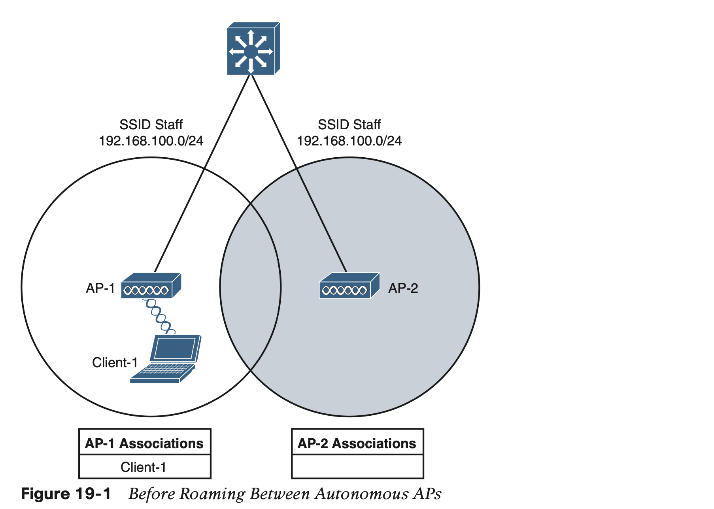

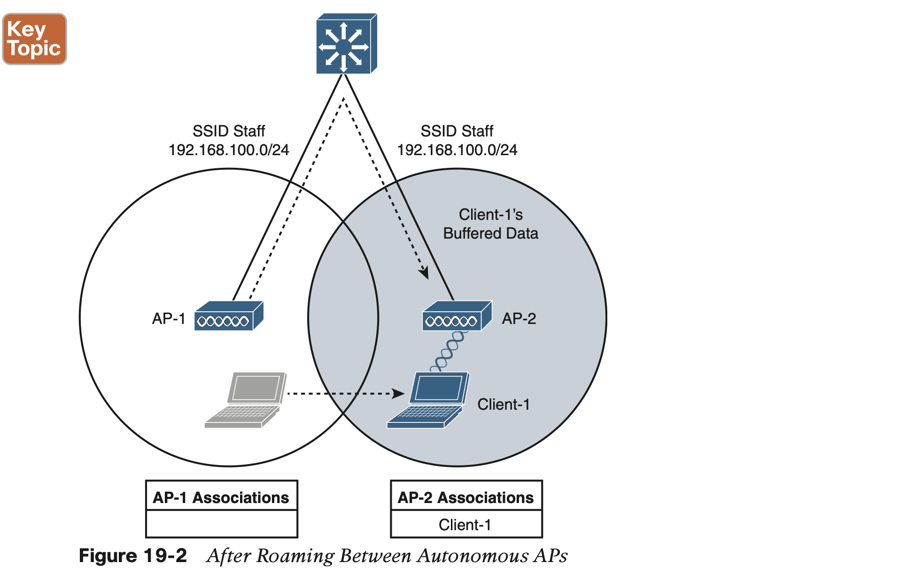

#### **Intracontroller Roaming**

In a Cisco wireless network, lightweight APs are bound to a wireless LAN controller through CAPWAP tunnels. The roaming process is similar to that of autonomous APs; clients must still reassociate to new APs as they move about. The only real difference is that the controller handles the roaming process, rather than the APs, because of the split-MAC architecture.

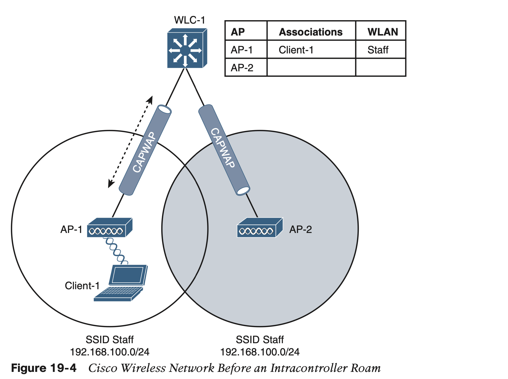

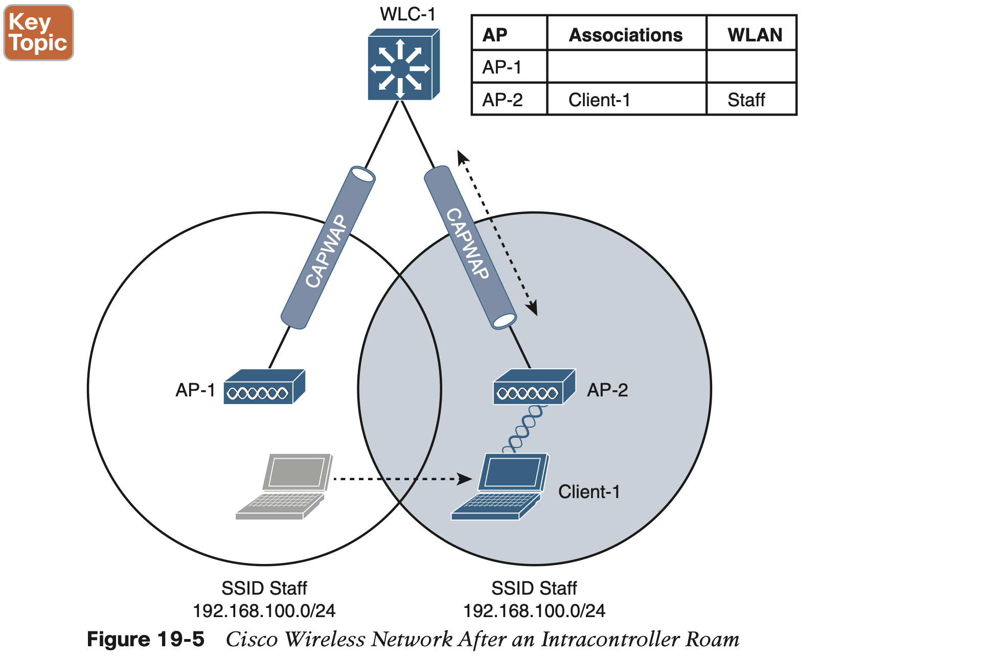

Cisco controllers offer three techniques to minimize the time and effort spent on key exchanges during roams:

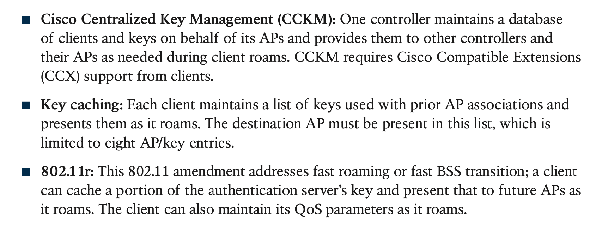

## 2. **Roaming Between Centralized Controllers**

The following sections cover intercontroller roaming, mobility groups, and the mechanisms used to coordinate roaming.

### **2.1 Layer 2 Roaming**

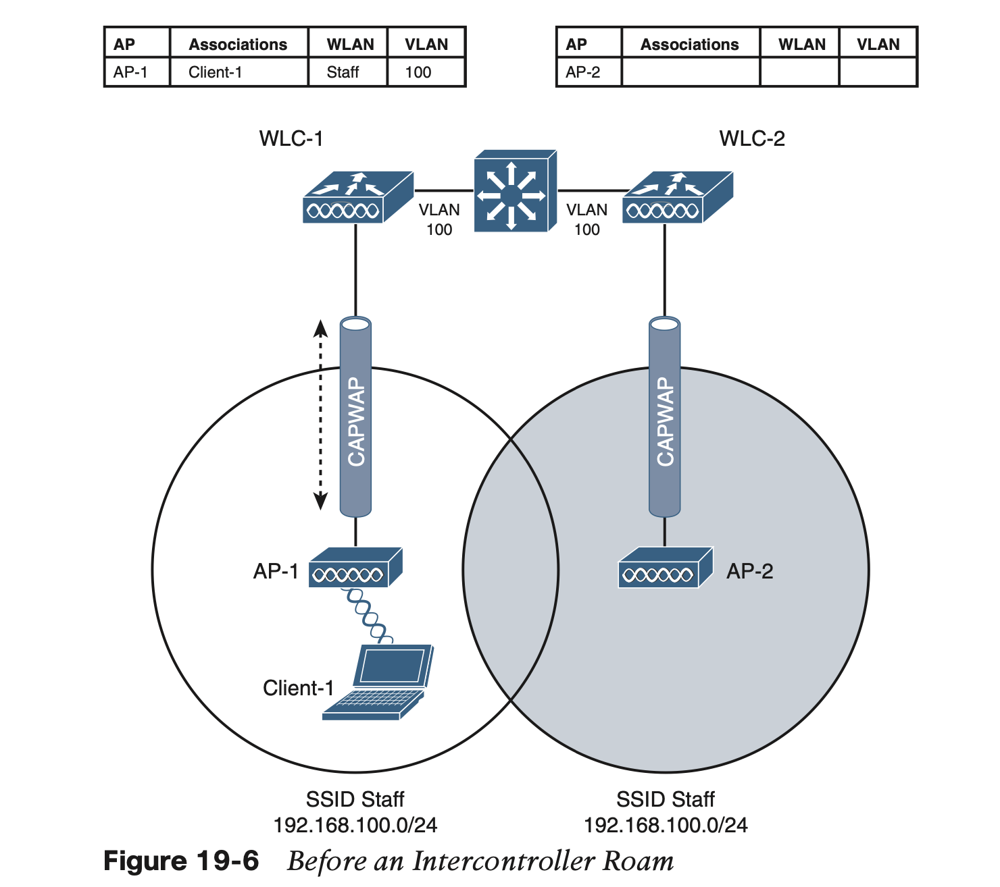

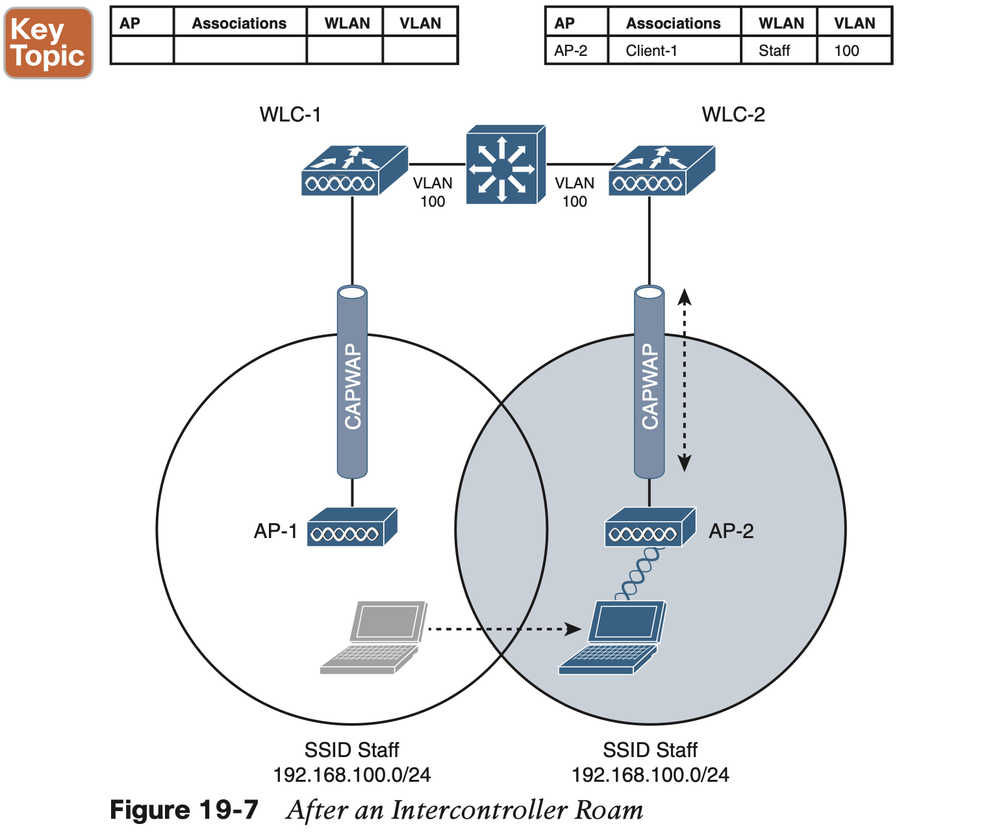

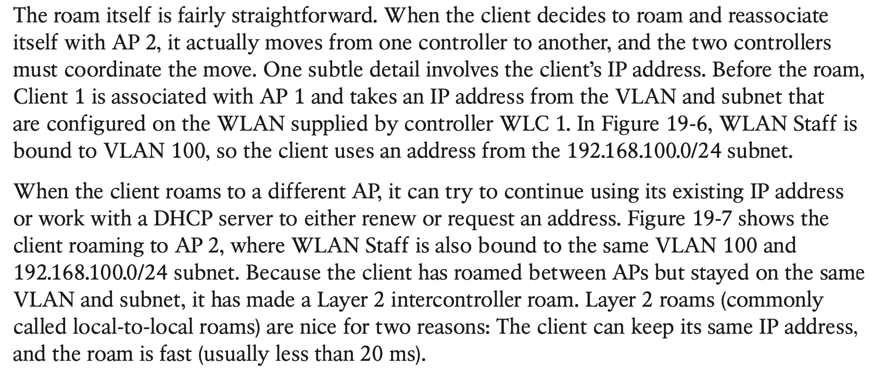

### 2.2 **Layer 3 Roaming**

 When a client initi- ates an intercontroller roam, the two controllers involved can compare the VLAN numbers that are assigned to their respective WLAN interfaces. If the VLAN IDs are the same, nothing special needs to happen; the client undergoes a Layer 2 intercontroller roam and can continue to use its original IP address on the new controller. If the two VLAN IDs differ, the controllers arrange a Layer 3 roam (also known as a local-to-foreign roam) that will allow the client to keep using its IP address.

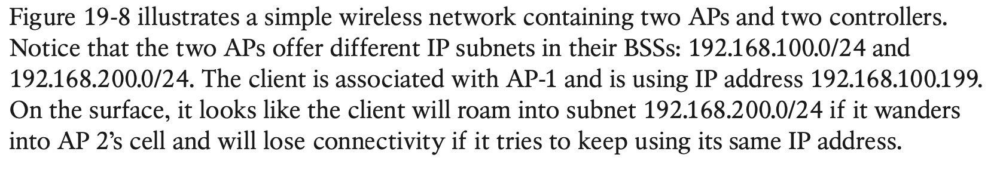

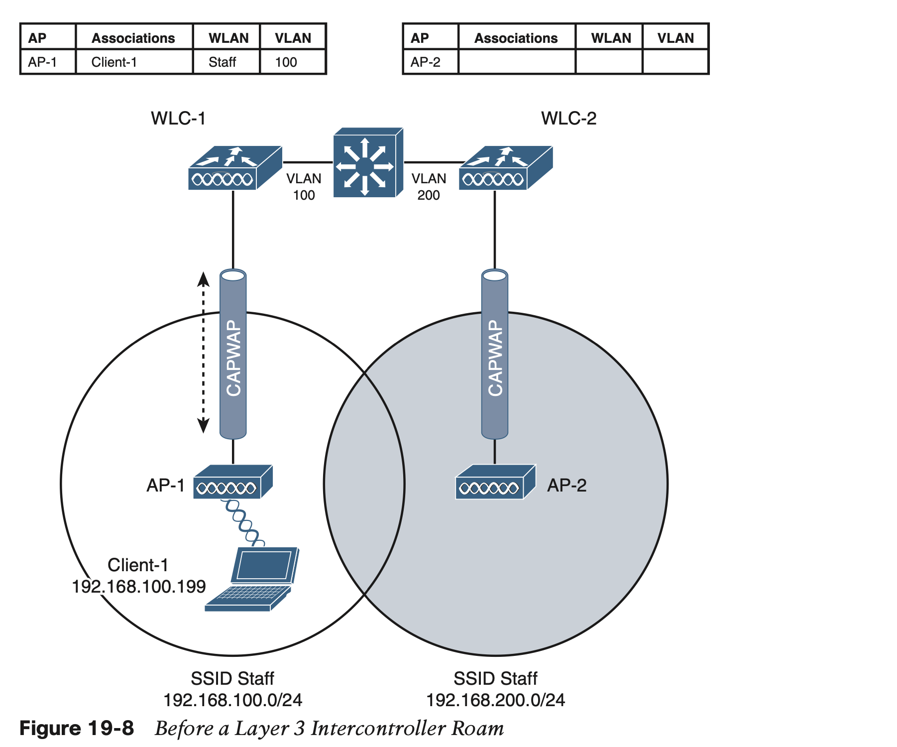

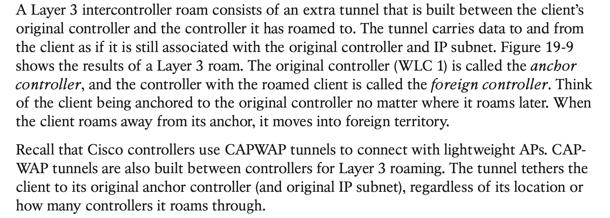

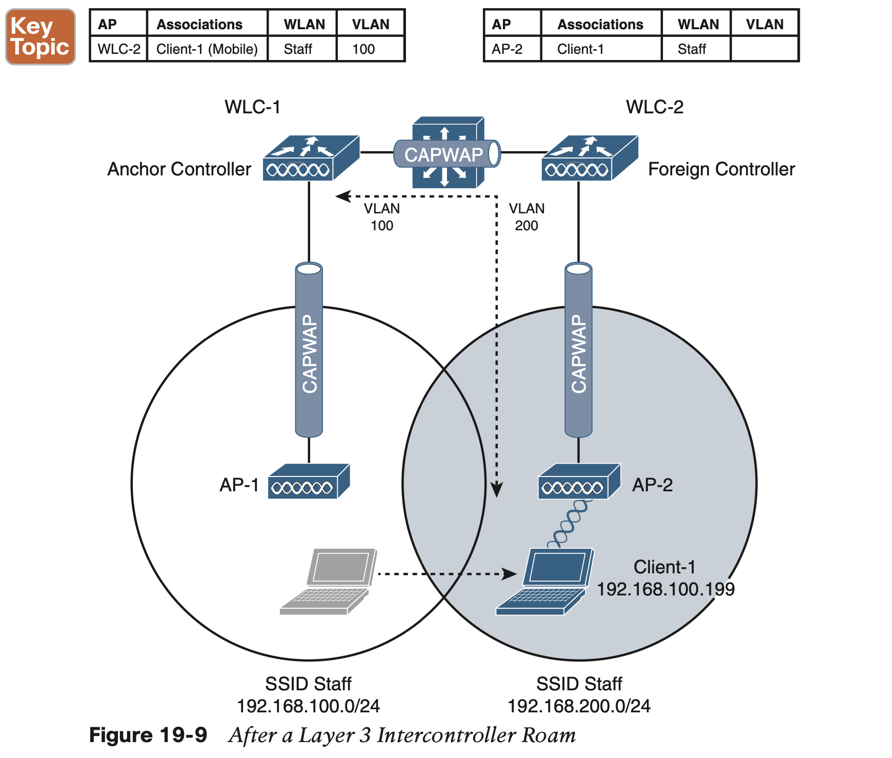

### 2.3 **Scaling Mobility with Mobility Groups**

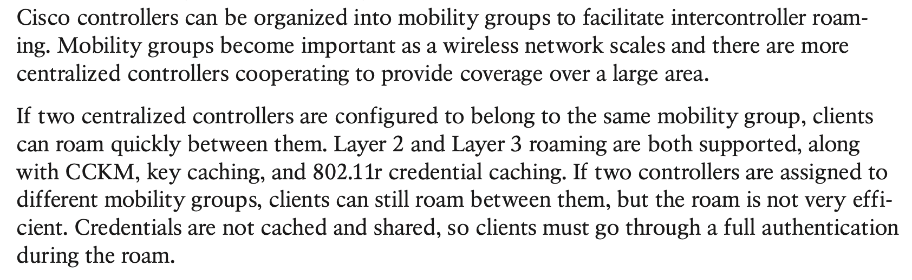

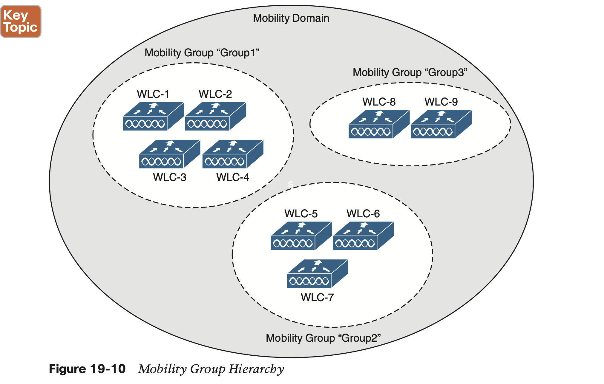

## 3. **Locating Devices in a Wireless Network**

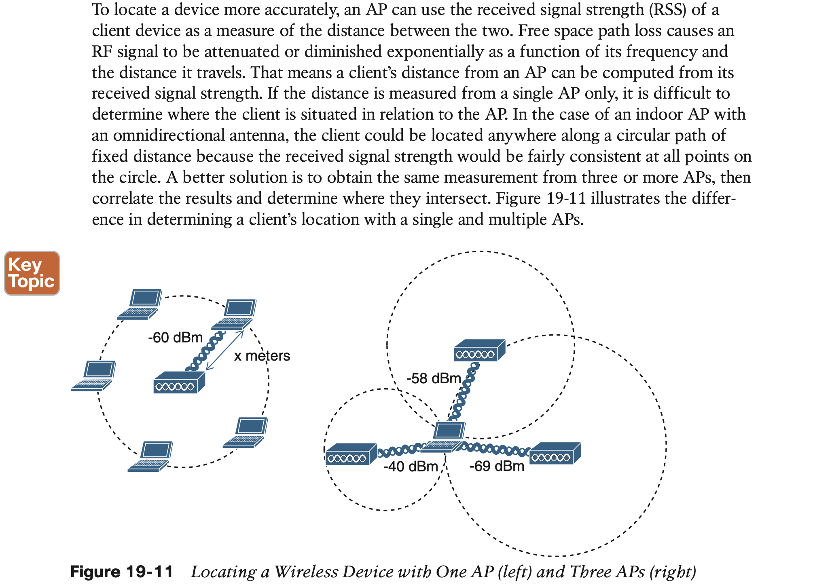

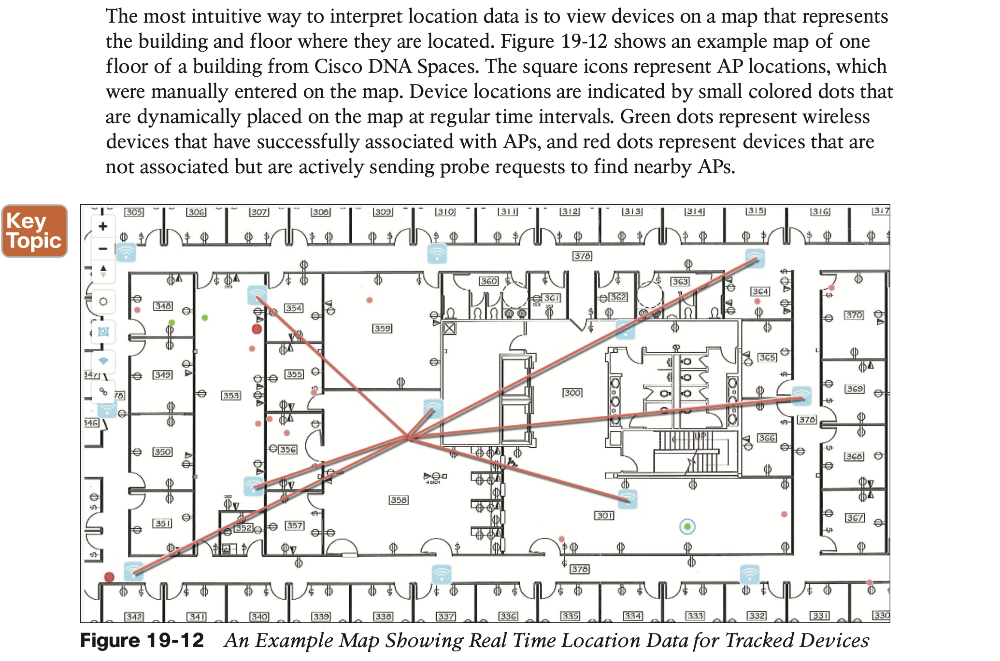

