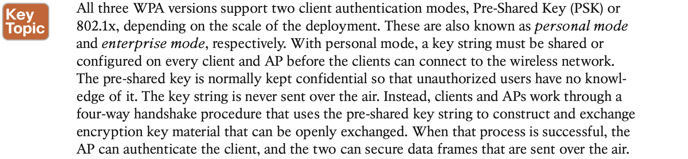
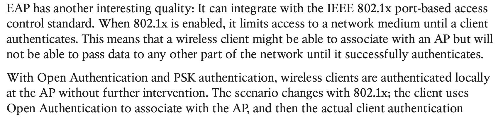
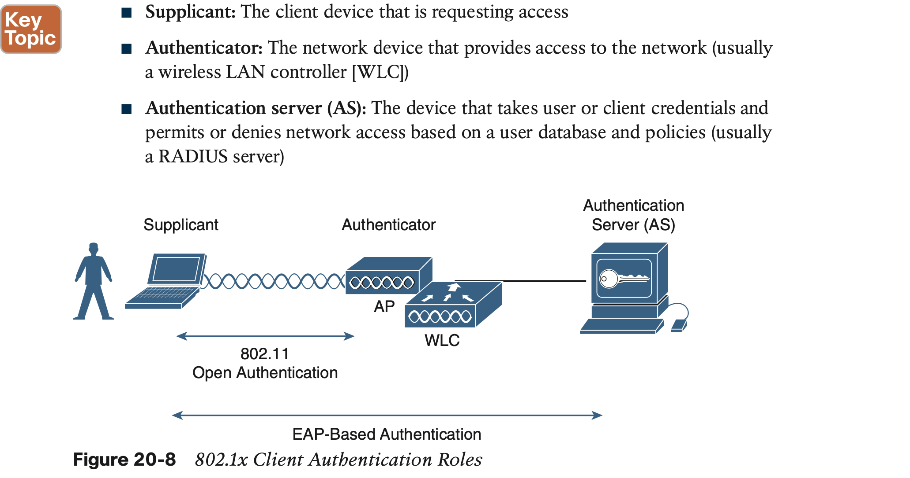
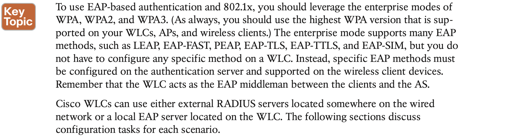

# **Authenticating Wireless Clients**

## 1. **Open Authentication**

 The original 802.11 standard offered only two choices to authenticate a client: Open Authentication and WEP.

Open Authentication is true to its name; it offers open access to a WLAN. The only requirement is that a client must use an 802.11 authentication request before it attempts to associate with an AP. No other credentials are needed.

## 2. **Authenticating with Pre-Shared Key**

## 3. **Authenticating with EAP**

#### **Configuring EAP-Based Authentication with External RADIUS Servers**

#### **Configuring EAP-Based Authentication with Local EAP**

## 4. **Authenticating with WebAuth**

