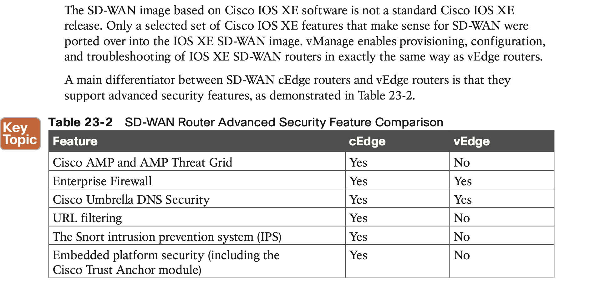

# **Fabric Technologies**

## 1. **Software-Defined Access (SD-Access)**

#### Network Layer

1. The network underlay is the underlying physical layer, and its sole purpose is to transport data packets between network devices for the SD-Access fabric overlay.

2. The overlay network is a virtual (tunneled) network that virtually interconnects all of the network devices forming a fabric of interconnected nodes. It abstracts the inherent complexities and limitations of the underlay network.

#### SD-Access Control Plane

#### SD-Access Fabric Data Plane

## 2. **Software-Defined WAN (SD-WAN)**

