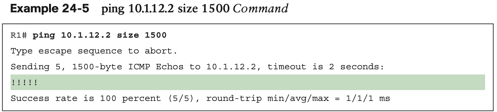
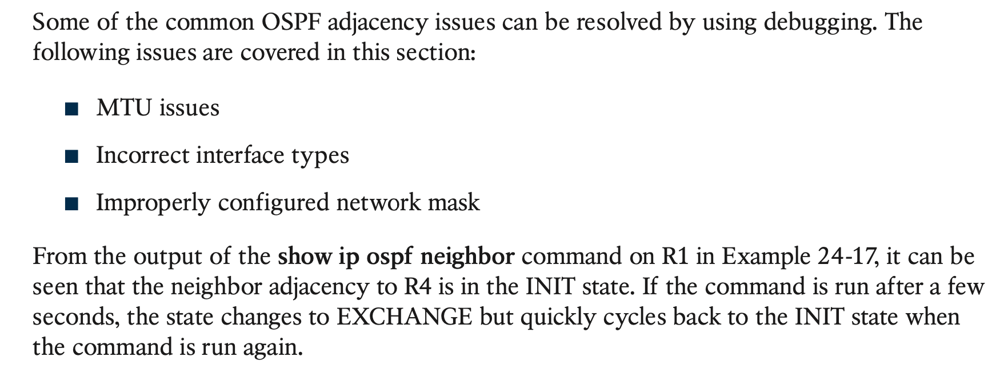
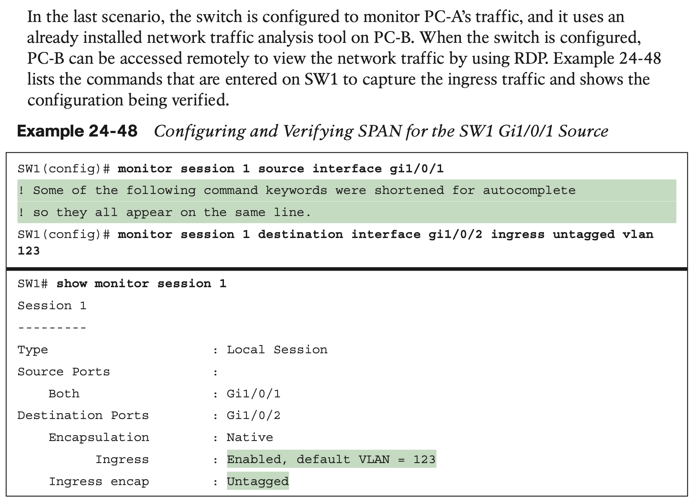

# **Network Assurance**

## 1. **Network Diagnostic Tools**

## 2. **Debugging**

#### **Conditional Debugging**

#### **Simple Network Management Protocol (SNMP)**

#### **syslog**

## 3. **NetFlow and Flexible NetFlow**

## 4. **Switched Port Analyzer (SPAN Technologies)**

### **Local SPAN**

### **Remote SPAN (RSPAN)**

### **Encapsulated Remote SPAN (ERSPAN)**

## 5. **IP SLA**

## 6. **Cisco DNA Center Assurance**

