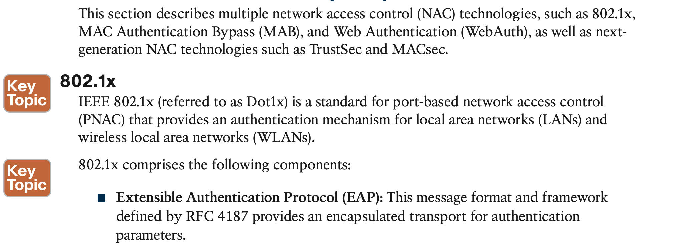

# **Secure Network Access Control**

## 1. **Network Security Design for Threat Defense**

## 2. **Next-Generation Endpoint Security**

The following sections describe the most critical components needed to implement the Cisco SAFE framework for a campus environment (or PIN, in Cisco SAFE terminology).

## 3. **Network Access Control (NAC)**

