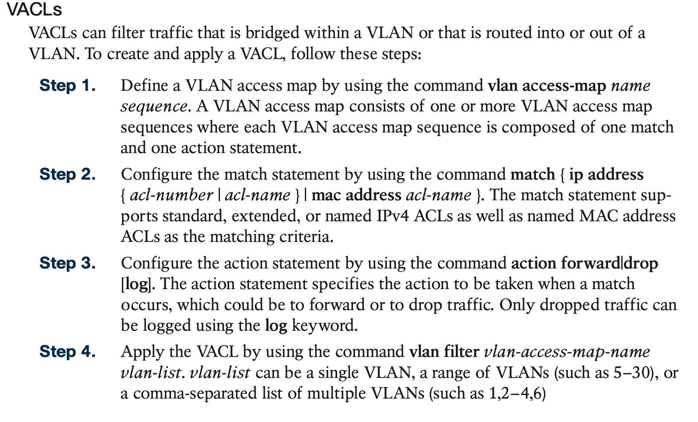

# **Network Device Access Control and Infrastructure Security**

## 1. **Access Control Lists (ACLs)**

### **Numbered Standard ACLs**

### **Numbered Extended ACLs**

### **Named ACLs**

Example 26-3 shows how named standard and extended ACLs are created and applied to an interface. The numbered ACLs in Examples 26-1 and 26-2 are included as a reference for easy comparison to named ACLs.

### **Port ACLs (PACLs) and VLAN ACLs (VACLs)**

Layer 2 Cisco switches support access lists that can be applied on Layer 2 ports as well as VLANs. Access lists applied on Layer 2 ports are called port access control lists (PACLs), and access lists applied to VLANs are called VLAN access control lists (VACLs).

#### PACLs

#### VACLs

## 2. **Terminal Lines and Password Protection**

#### **Password Encryption**

#### **Username and Password Authentication**

#### **Configuring Line Local Password Authentication**

#### **Configuring Line Local Username and Password Authentication**

#### **Privilege Levels and Role-Based Access Control (RBAC)**

#### **Controlling Access to vty Lines with ACLs**

#### **Enabling SSH vty Access**

## 3. **Authentication, Authorization, and Accounting (AAA)**

The following sections explain why TACACS+ is preferred for network access control while RADIUS is preferred for secure network access.

#### **Configuring AAA for Network Device Access Control**

## 4. **Zone-Based Firewall (ZBFW)**

#### **ZBFW Configuration**

## 5. **Control Plane Policing (CoPP)**

#### **Configuring ACLs for CoPP**

#### **Configuring Class Maps for CoPP**

#### **Configuring the Policy Map for CoPP**

#### **Applying the CoPP Policy Map**

## 6. **Device Hardening**

