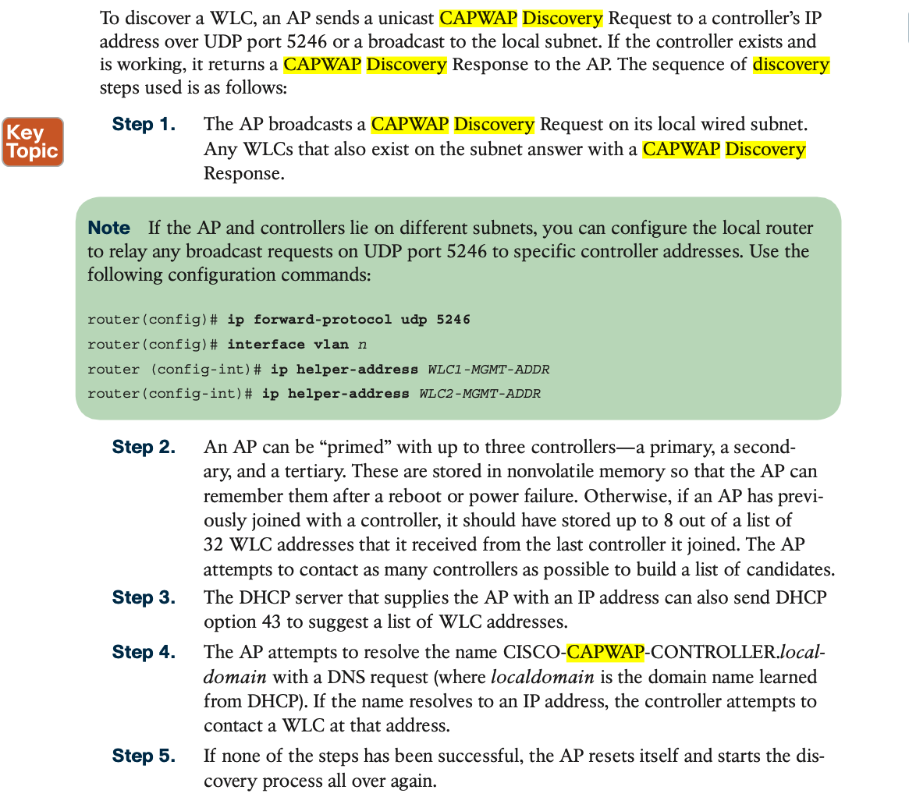
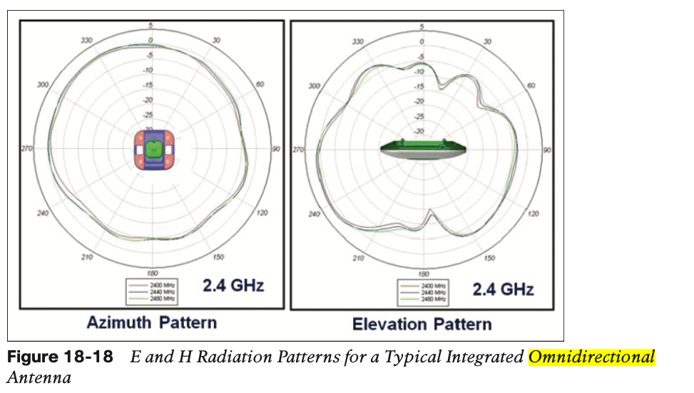
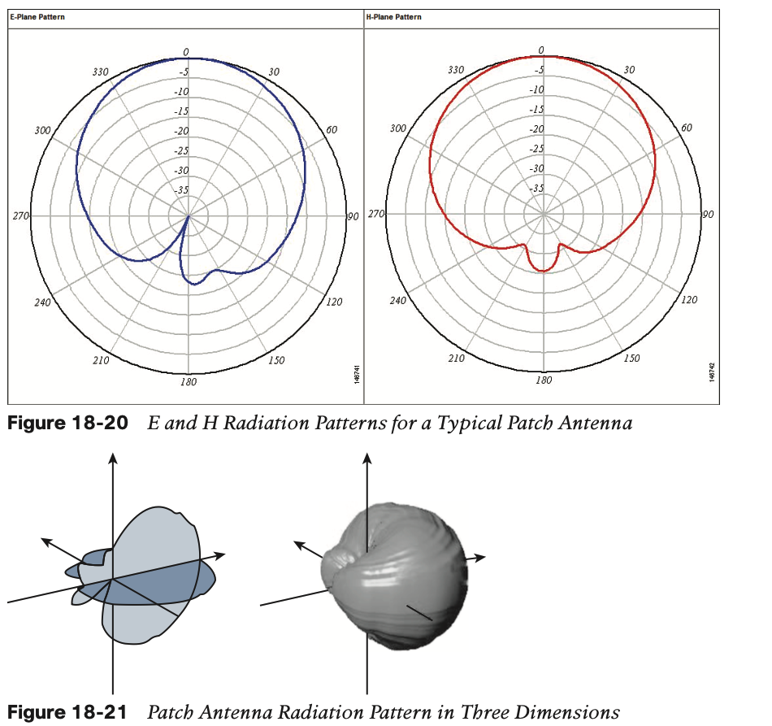
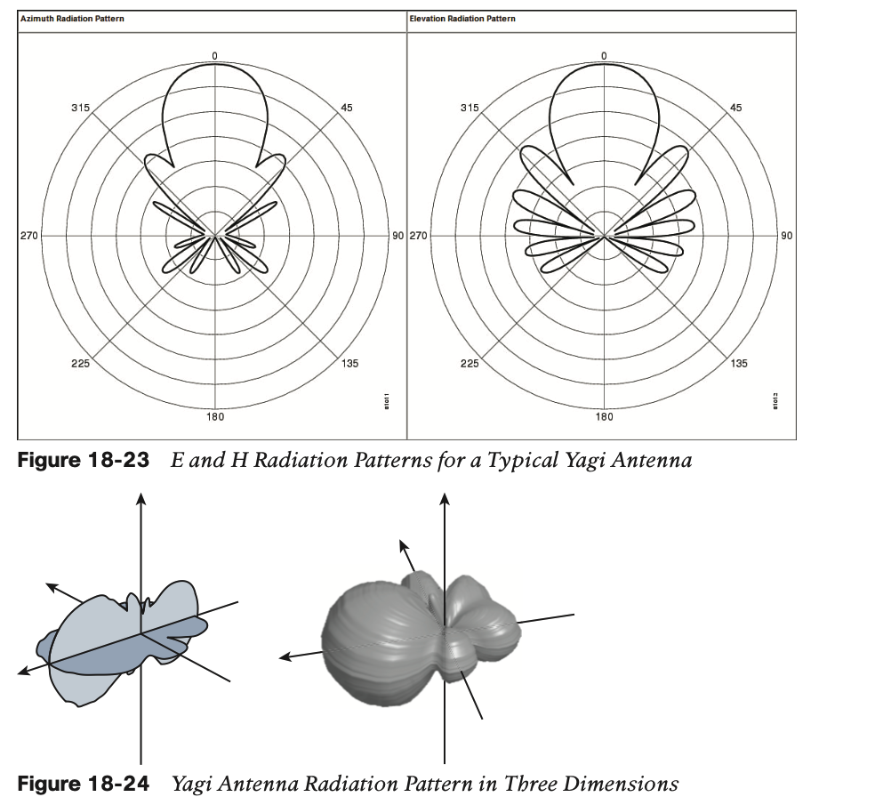
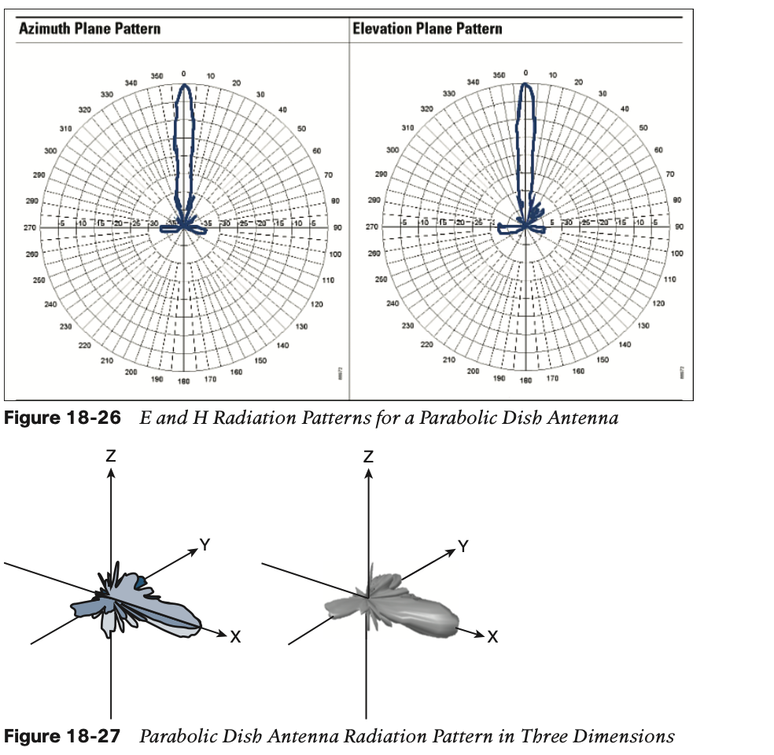
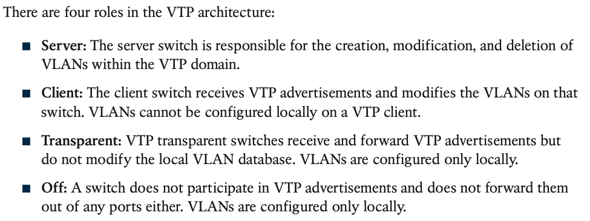
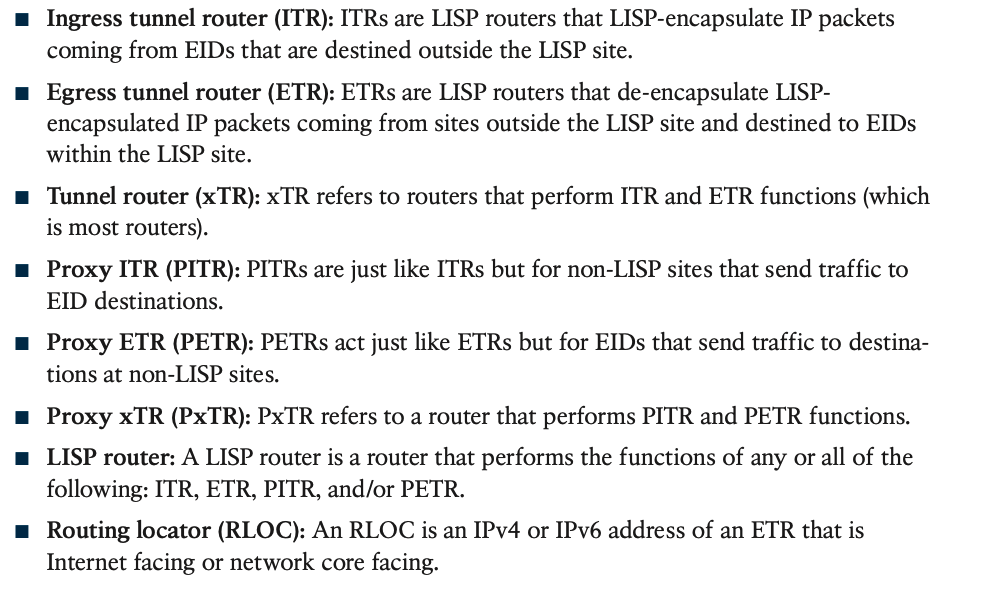
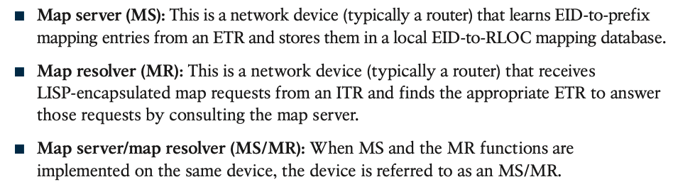
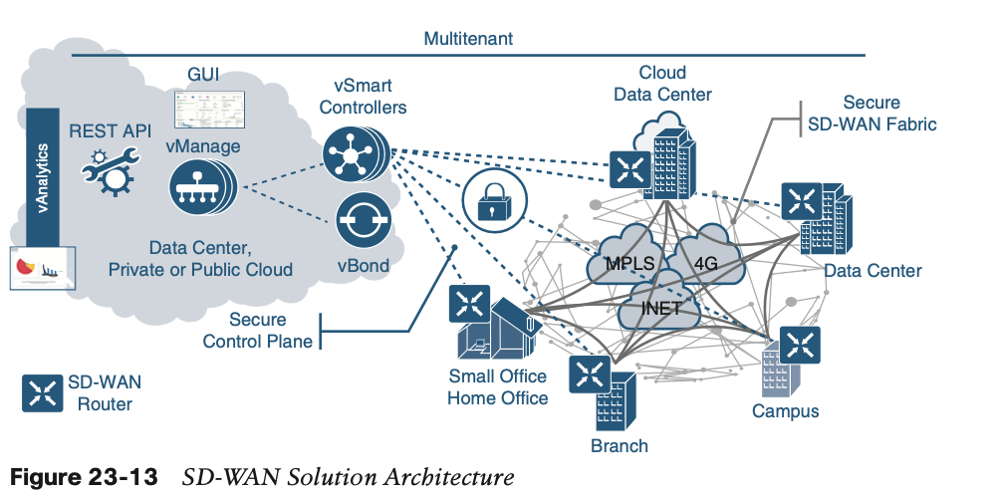
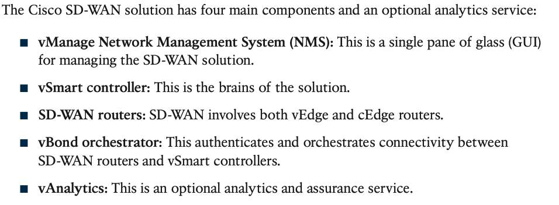

#### Q200

#### Q199

**BPDU Guard:** BPDU guard is a safety mechanism that shuts down ports configured with STP portfast upon receipt of a BPDU.

**BPDU Filter:** BPDU filter simply blocks BPDUs from being transmitted out a port.

#### Q198

#### Q193

The AP goes through this process on startup:

1. The LAP boots and DHCPs an IP address if it was not previously assigned a static IP address.
2. The LAP sends discovery requests to controllers through the various discovery algorithms and builds a controller list. Essentially, the LAP learns as many management interface addresses for the controller list as possible via:
   1. DHCP option 43 (good for global companies where offices and controllers are on different continents).
   2. DNS entry for `cisco-capwap-controller` (good for local businesses - can also be used to find where brand new APs join) If you use CAPWAP, make sure there is a DNS entry for `cisco-capwap-controller`.
   3. Management IP addresses of controllers the LAP remembers previously.
   4. A Layer 3 broadcast on the subnet.
   5. Statically configured information.
   6. Controllers present in the mobility group of the WLC the AP last joined.

#### Q191

“No Hellos (Passive Interface)”. If you configure passive interface then the network on the interface will still be advertised but it won’t send any OSPF hello packets. This way it’s impossible to form an OSPF neighbor adjacency.

#### Q186

#### Q183 antenna

#### **Omnidirectional Antennas**

#### **Directional Antennas**

#### Q177

#### Q171

#### Q168

#### Q160

#### Q155

The RP receives PIM join from the LHR 

The LHR receives IGMP join from the receiver 

The RP receives PIM register from the FHR

(RP) is used to establish communication between a source and the receivers in a multicast group using PIM protocols, so it sends join messages toward a multicast source using Protocol (PIM) to build the distribution tree for the multicast group SPT

#### Q144

In essence, two trees are created: an SPT from the FHR to the RP (S,G) and a shared tree from the RP to the LHR (*,G). The RP is the root of the shared tree in PIM sparse mode

Multicast Distribution Shared Tree - Unlike source trees that have their root at the source, shared trees use a single common root placed at some chosen point in the network. This shared root is called a rendezvous point (RP).

#### Q143

#### Q139

Weight only applies to the Router it is applied to, Local preference will apply to the whole AS group.

#### Q136

weight, local preference, AS path, MED

#### Q133 AP

#### Q132 AP

#### Q130 OSPF

#### Q126 VTP 

#### Q125 OSPF - LSA type

LSA Type 1: Router LSA 

LSA Type 2: Network LSA 

LSA Type 3: Summary LSA 

LSA Type 4: Summary ASBR LSA

LSA Type 5: Autonomous system external LSA 

LSA Type 6: Multicast OSPF LSA 

LSA Type 7: Not-so-stubby area LSA 

LSA Type 8: External attribute LSA for BGP

#### Q116 multicast RPs

By default, the RP is needed only to start new sessions with sources and receivers.

#### Q114 OSPF network types

Here is a quick list of which combinations will work: 

- Broadcast to Broadcast 

- Non-Broadcast to Non-Broadcast 

- Point-to-Point to Point-to-Point 

- Point-to-Multipoint to Point-to-Multipoint 

- Broadcast to Non-Broadcast (adjust hello/dead timers) 

- Point-to-Point to Point-to-Multipoint (adjust hello/dead timers)

#### Q111 WLAN

#### Q110 NAT

#### Q108 EAP-FAST

#### Q106 WLC

#### Q103 AP

#### Q100 GRE tunnel

#### Q99/Q98 VRF

#### Q95 LISP

To establish communication between LISP and non LISP sites an extra components must be use, a proxy ingress tunnel router (PITR), which allows non-LISP sits to send packet toward LISP sites. The PITR attracts traffic from non-LISP sites by advertising aggregate prefixes for the LISP EID into the non-LISP network. When PITR receives packets from non-LISP sites it encapsulate and forward these packets to LISP sites. 

The second element to establish communication between the LISP and non-LISP sites is called a proxy egress tunnel router (PETR). The PETR allows the communication from the LISP sites to the non-LISP sites. The PETR receives LISP encapsulated traffic from ITR. The PITR and PETR can be combine and deployed on the same node called (PxTR) to provide symmetric traffic when stateful inspection devices are deployed between LISP and non-LISP sites.

#### Q89 GRE/IPSec ? 

#### Q79 LISP 

#### Q78 GRE

#### Q70 GRE/IP

The TCP Maximum Segment Size (TCP MSS) defines the maximum amount of data that a host is willing to accept in a single TCP/IP datagram. This TCP/IP datagram might be fragmented at the IP layer. The MSS value is sent as a TCP header option only in TCP SYN segments. Each side of a TCP connection reports its MSS value to the other side. Contrary to popular belief, the MSS value is not negotiated between hosts. The sending host is required to limit the size of data in a single TCP segment to a value less than or equal to the MSS reported by the receiving host.

#### Q69 VXLAN 

#### Q66 VRF ?

#### Q61 VM

#### Q60 Link Management Protocol

The Link Management Protocol (LMP) is activated on each link of the StackWise Virtual link as soon as it is brought up online. The LMP performs the following functions: 

• Verifies link integrity by establishing bidirectional traffic forwarding, and rejects any unidirectional links 

• Exchanges periodic hellos to monitor and maintain the health of the links 

• Negotiates the version of StackWise Virtual header between the switches

#### Q59/Q54/Q50/Q9 Cisco SD-WAN

#### Q58 WLC

#### Q52 QoS

#### Q49/Q48/Q47 Cisco SD-Access?

**SDA supports two additional types of roaming, which are Intra-xTR and Inter-xTR.** In SDA, xTR stands for an access-switch that is a fabric edge node. It serves both as an ingress tunnel router as well as an egress tunnel router. 

When a client on a fabric enabled WLAN, roams from an access point to another access point on the same access-switch, it is called Intra-xTR. Here, the local client database and client history table are updated with the information of the newly associated access point.

 When a client on a fabric enabled WLAN, roams from an access point to another access point on a different access-switch, it is called Inter-xTR. Here, the map server is also updated with the client location (RLOC) information. Also, the local client database is updated with the information of the newly associated access point.

#### Q46 SD-Access

Border node: The border nodes serve as the gateways between the Cisco SD-Access fabric and external networks.

#### Q42 Load Balancing

#### Q39/Q11 SD-Access

#### Q38/Q34/Q33/Q31 SD-Access

#### Q36 TCAM

#### Q28 three-tier hierarchical campus network

A. provide QoS prioritization services such as marking, queueing, and classification for critical network traffic. Distribution layer. 

B. provide redundant Layer 3 point-to-point links between the core devices for more predictable and faster convergence. Core Layer. 

C. provide advanced network security features such as 802.1X, DHCP snooping, VACLs, and port security. Access Layer. 

D. provide redundant aggregation for access layer devices and first-hop redundancy protocols such as VRRP. Distribution layer.

#### Q25 SD-Access

#### Q20 SSO

#### Q4

