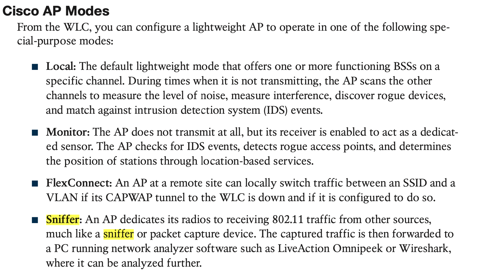
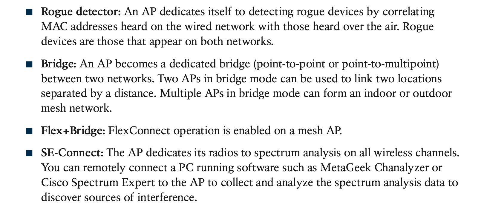

|      | ——————————-Number     | Description                                                  |
| ---- | :-------------------- | ------------------------------------------------------------ |
| 3    | Q398 BGP              |                                                              |
| 3    | Q394 HTTPS            | Core-Switch(config)#crypto pki trustpoint Core-Switch  Core-Switch(ca-trustpoint)#enrollment terminal  Core-Switch(config)#crypto pki enroll Core-Switch |
| 4    | Q390 VRF              | ???????????????                                              |
| 3    | Q386 HTTPS            |                                                              |
| 3    | Q382 SD-Access        |                                                              |
| 4    | Q381 route-map        | ???????????????                                              |
| 4    | Q380  ip prefix-list  | ???????????????                                              |
| 3    | Q371 Event manager    |                                                              |
| 4    | Q367 NTP              | ASTERISK * - Time is not authoritative: the software clock is not in sync or has never been set.  BLANK - Time is authoritative: the software clock is in sync or has just been set manually.  DOT . - Time is authoritative, but NTP is not synchronized: the software clock was in sync, but has since lost contact with all configured NTP servers. |
| 3    | Q364 SDN              |                                                              |
| 4    | Q363 prefix list      | ?????????????????                                            |
| 4    | Q355 ip sla           |                                                              |
| 3    | Q354 Event manager    | abcde  a=minute (0-59)  b=hour (0-23)  c=day of month (1 - 31)  d=month (1 - 12) January is 1  e=day of week (0 - 6) Sunday is 0 |
| 4    | Q350 python           |                                                              |
| 4    | Q346 YANG             | ?                                                            |
| 3    | Q339 DNA              | Error—Device had an error and could not be provisioned.  Unclaimed—Device has not been assigned a workflow.  Planned—Device is added to Network Plug and Play and has been assigned a workflow, but has not yet contacted the server.  Provisioned—Device is successfully onboarded and added to inventory |
| 3    | Q337 SDA              |                                                              |
| 3    | Q332 Event manager    |                                                              |
| 3    | Q330 Event manager    |                                                              |
| 3    | Q326 OAuth            |                                                              |
| 3    | Q322 HTTP status code | 400 Bad Request  401 Unauthorized  402 Payment Required  403 Forbidden  404 Not Found  405 Method Not Allowed |
| 3    | Q321 YANG             |                                                              |
| 3    | Q320 Auth             | JSON Web Token                                               |
| 3    | Q319 RESTCONF         | Accept header is a way for a client to specify the media type of the response content it is expecting  Content-type is a way to specify the media type of request being sent from the client to the server. |
| 3    | Q316 JSON web token   | JWT in the serialized form represents a string of the following format:  [header].[payload].[signature] |
| 4    | Q311 Json             |                                                              |
| 3    | Q308 Python           |                                                              |
| 3    | Q304 VTY              |                                                              |
| 4    | Q301 MACsec           |                                                              |
| 4    | Q297 IPSec            |                                                              |
| 3    | Q295 WLC override     |                                                              |
| 3    | Q292 ACL              | Access control lists that are applied outbound to a router interface do not affect traffic that is sourced from the router. |
| 3    | Q290 SDN              |                                                              |
| 4    | Q289 CoPP             | The given answer is correct (C) as the configuration is blocking traffic to the control plane of the appliance using Control Plane Policing (CoPP). |
| 3    | Q286 ACL              | inbound                                                      |
| 3    | Q285 ACL              | Standard 1–99 and 1300–1999  Extended IP 100–199 and 2000–2699 |
| 3    | Q283 AAA              |                                                              |
| 3    | Q281  SD-Access       |                                                              |
| 3    | Q277                  | ESA – Email Security Appliance Umbrella – Formerly known as OpenDNS FTD – Firepower Threat Defense |
| 3    | Q276 CoPP             |                                                              |
| 3    | Q275 AAA              |                                                              |
| 3    | 271 ACL               |                                                              |
| 3    | Q268 WLC              | RADIUS Server Overwrite interface check box to enable the per-WLAN RADIUS source support:  1.When enabled, the controller uses the interface specified on the WLAN configuration as identity and source for all RADIUS related traffic on that WLAN.  2. When disabled, the controller uses the management interface as the identity in the NAS-IP-Address attribute. |
| 3    | Q262 Authentication   | local WLC                                                    |
| 3    | Q260 TrustSec         | Cisco TrustSec SGT tags are assigned to authenticated groups of users or end devices |
| 3    | Q259 Auth             |                                                              |
| 3    | Q257 NGFW             | only inline mode place the FTD in the path of actual data and the FTD can drop packets.  Inline Tap just log the bad packets but do not disturb the flow .  and passive mode FTD is sit out of the data path and receive mirrored data from SPAN port. |
| 3    | Q256 sla              |                                                              |
| 3    | Q254 traceroute       |                                                              |
| 4    | Q253                  | ????????????                                                 |
| 3    | Q250 DNA              |                                                              |
| 3    | Q248 Monitor          | the monitor session can source interface or vlan not both at the same time |
| 3    | Q246 log              | Even awesome cisco engineer will need ice-cream daily 0 —emergency: System unusable  1 —alert: Immediate action needed  2 —critical: Critical condition—default level  3 —error: Error condition 4 —warning: Warning condition  5 —notification: Normal but significant condition  6 —informational: Informational message only  7 —debugging: Appears during debugging only |
| 3    | Q244                  | TCP/514 - shell cmd  UDP/514 - syslog  TCP/6514 - syslog over TLS  UDP/6514 - syslog over DTLS |
| 4    | Q243 log              |                                                              |
| 4    | Q242 Netflow          |                                                              |
| 3    | Q240 Netflow          |                                                              |
| 3    | Q237 Monitor          | Encapsulated remote SPAN (ERSPAN): encapsulated Remote SPAN (ERSPAN), as the name says, brings generic routing encapsulation (GRE) for all captured traffic and allows it to be extended across Layer 3 domains. |
| 3    | Q236 Monitor          |                                                              |
| 3    | Q235                  | Northbound: Discovery and management of the network over REST API  Southbound: SDK integration into the DNA Center via device packs to support multivendor environment  Eastbound: Event / Notification Handler  Westbound: Integration of reporting, analysis, service management |
| 3    | Q234 RESTCONF         | NGINX is an internal webserver that acts as a proxy webserver. It provides Transport Layer Security (TLS)-based HTTPS. RESTCONF request sent via HTTPS is first received by the NGINX proxy web server and the request is transferred to the confd web server for further syntax/semantics check. |
| 4    | Q232 Netconf          | upvoted 33 timesIf a request is made for a data model that doesn’t exist on the Catalyst 3850 or a request is made for a leaf that is not implemented in a data model, the Server (Catalyst 3850) responds with an empty data response. This is expected behavior. |
| 3    | Q228 AP               | Sensor mode: this is a special mode which is not listed in the books but you need to know. In this mode, the device can actually function much like a WLAN client would associating and identifying client connectivity issues within the network in real time without requiring an IT or technician to be on site. |
| 3    | Q226 NAT              |                                                              |
| 4    | Q223 MSDP             | Multicast Source Discovery Protocol (MSDP) to interconnect multiple PIM-SM domains. |
| 3    | Q222 VRRP             |                                                              |
| 3    | Q220 WIFI6            |                                                              |
| 3    | Q217 AP mode          |                                                              |
| 4    | Q214 AP mode          |                                                              |
| 3    | Q210                  |                                                              |
| 3    | Q209 PIM DM           |                                                              |
| 3    | Q208 VTP              |                                                              |
|      |                       |                                                              |
|      |                       |                                                              |

​		**Sensor mode:** this is a special mode which is not listed in the books but you need to know. In this mode, the device can actually function much like a WLAN client would associating and identifying client connectivity issues within the network in real time without requiring an IT or technician to be on site.
